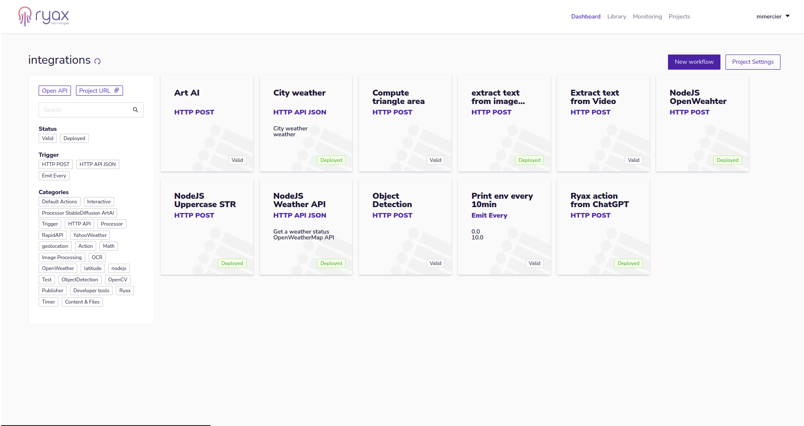
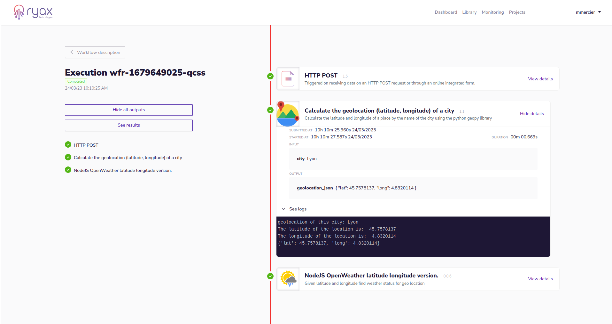

<div align="center">

  <a href="https://ryax.tech">
    
    
  </a>
  <h3 align="center">Ryax</h3>

  <p align="center">
    Developers, build your backends in record time; deploy at scale with serverless technology; self-host, install on any cloud or use our hosted platform; Open source, low code.
    <br />
    <a href="https://docs.ryax.tech/"><strong>Explore the docs »</strong></a>
    <br />
    <br />
    <a href="https://www.youtube.com/watch?v=PUVgu8lkNJI">View Demo</a>
    ·
    <a href="https://gitlab.com/ryax-tech/ryax/ryax-main/-/issues/new">Report Bug</a>
    ·
    <a href="https://gitlab.com/ryax-tech/ryax/ryax-main/-/issues/new">Request Feature</a>
    ·
    <a href="https://discord.gg/bg7s7Es8">Talk with the devs</a>
  </p>
</div>

**WARNING: We use GitLab for our development, if you want to see the whole application code see https://gitlab.com/ryax-tech/ryax/**

## ⭐ About the project


Ryax is an open-source platform that streamlines the design, deployment, and
monitoring of backend automations and APIs.

## ⚙ The source code

Ryax is composed of multiple micro-services and tools. To learn more about the internal architecture, see [the documentation](https://docs.ryax.tech/reference/architecture.html). The main components are:

**User interfaces**
 - [front](https://gitlab.com/ryax-tech/ryax/ryax-front.git): The WebUI.
 - [adm](https://gitlab.com/ryax-tech/ryax/ryax-adm.git): The Ryax ADMinistrationn tool. To install, update, backup and more.
 - [cli](https://gitlab.com/ryax-tech/ryax/ryax-cli.git): The CLI to command Ryax

**Micro-services**
 - [authorization](https://gitlab.com/ryax-tech/ryax/ryax-authorization.git): Answer to the question: "do you have the rights to do so?".
 - [repository](https://gitlab.com/ryax-tech/ryax/ryax-repository.git): Scan git repositories to find actions.
 - [runner](https://gitlab.com/ryax-tech/ryax/ryax-runner.git): A trigger or an action run? It handles it.
 - [studio](https://gitlab.com/ryax-tech/ryax/ryax-studio.git): Handles the edition of workflows.
 - [action-builder](https://gitlab.com/ryax-tech/ryax/ryax-action-builder.git): Builds actions and triggers.
 - [ryax-action-wrappers](https://gitlab.com/ryax-tech/ryax/ryax-action-wrappers.git): The code between the action code and Ryax.

**Other**
 - [default-actions](https://gitlab.com/ryax-tech/workflows/default-actions.git): Some open-source actions and triggers.
 - [errored-actions](https://gitlab.com/ryax-tech/ryax/errored-actions.git): Actions with errors, very useful to test the robustness of Ryax.
 - [common-helm-charts](https://gitlab.com/ryax-tech/ryax/common-helm-charts): Set of common templates for Ryax services library charts

**Main technologies used by Ryax**

The code: **[Python](https://www.python.org/)**, [dependency-injector](https://python-dependency-injector.ets-labs.org/index.html), [SQLalchemy](https://docs.sqlalchemy.org), [GRPC](https://grpc.io/).

Around the code: [Nix](nixos.org/), [poetry](https://python-poetry.org/), [black](https://black.readthedocs.io/en/stable/), [mypy](https://mypy.readthedocs.io/).

Deploying Ryax: [Kubernetes](https://kubernetes.io/), [Terraform](https://www.terraform.io/), [Helm](https://helm.sh/).


## ⚡ Getting started with Ryax

### Requirements

All you need to install Ryax is a Kubernetes cluster. Supported versions are:

* kubernetes > 1.19; <1.25

Hardware:

* At least 2 CPU core
* 4GB or memory
* 40GB of disk available


**Note that depending on the Actions that you run on your cluster you might need
more resources.**


### On a local machine with Docker

We recommend this option if you wish to test our product with a minimal amount of configuration steps, and if you have enough RAM (~3GB) and disk (20GB) available.

**/!\ Warning**: **Do not use this setup in production!**
**/!\ Warning**: To make it easier for you to access the cluster from your
browser, we expose the ports 80 (http) and 443 (https) on your local machine.
Make sure these aren't already used!

Copy the [docker-compose.yml](https://gitlab.com/ryax-tech/ryax/ryax-main/-/blob/master/docker-compose.yml) file form this repository and run:
```sh
docker-compose up -d
```

Wait for the installation to finish by checking for the install container
state with:
```sh
docker logs $(basename $PWD)-install-ryax-1 -f
```
Be patient, this may take around 15 minutes (or more depending on your internet
connection).

Once its done you can access to your cluster with:
[http://localhost/app/login]()

Default credentials are:
- user: `user1`
- password: `pass1`

To uninstall your cluster, stop it with:
```sh
docker-compose down -v
```

### On an existing Kubernetes cluster

This is the standard and recommended approach.
It works on most managed Kubernetes, like AWS EKS, Azure AKS, GCP GKE.

For more details on the configuration, see [our documentation](https://docs.ryax.tech/howto/install_ryax_kubernetes.html).


## 🛹 Roadmap

A more complete roadmap will be published soon.

- [x] Create workflows
- [x] Support actions and triggers made in python
- [x] User and project management
- [x] HTTP API automatic creation (with OpenAPI interactive UI!)
- [x] Manage credentials for the integrations with shared variables
- [x] Support actions made in Javascript(Nodejs) and C#
- [ ] Backend as a Service with on-demand with dedicated database, object store, message
  broker...
- [ ] Support any docker based services
- And much more!

## 🤗 Contributing

If you want to say thank you and/or support the active development of Ryax:

1. Add a [GitHub Star](https://github.com/RyaxTech/ryax/) to the project.
2. Tweet about the project on your Twitter.
3. Write a review or tutorial on Medium, Dev.to or personal blog.
4. Share some triggers and actions with the [community](https://discord.gg/bg7s7Es8).
5. Fix bugs and implement features to [our code](https://gitlab.com/ryax-tech/ryax/ryax-main).


[Discord](https://discord.gg/bg7s7Es8),
[Reddit](https://www.reddit.com/r/ryax/),
[Slack](https://join.slack.com/t/ryax/shared_invite/zt-fjx7pud0-GAYiNrDEa1hHyArs5etMiA)
