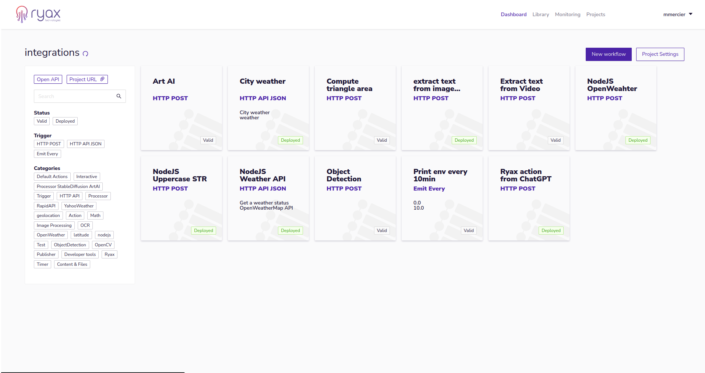
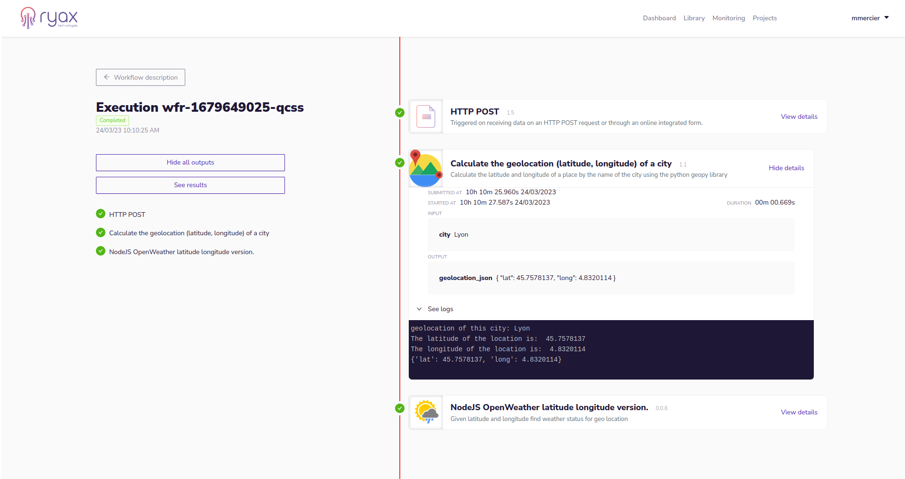
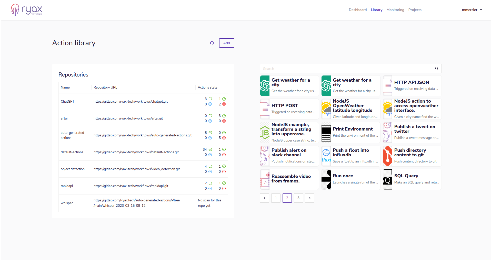
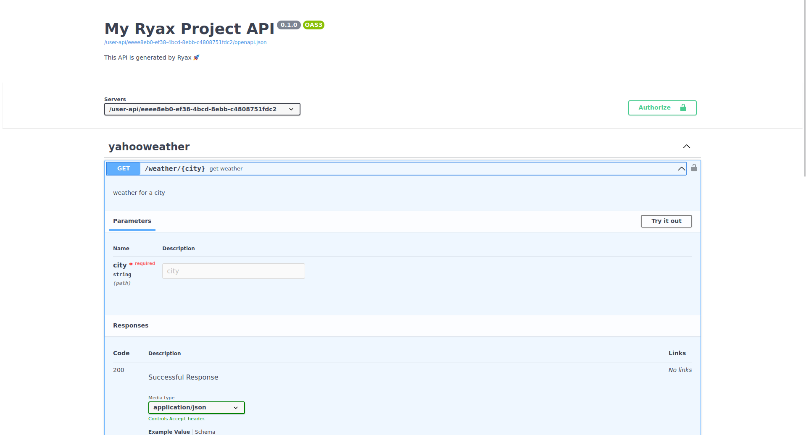

<div align="center">

  <a href="https://ryax.tech">
    
  </a>
  <h3 align="center">Ryax</h3>

  <p align="center">
    Developers, build your AI workflows and applications in record time; deploy at scale with serverless technology; self-host, install on any cloud and HPC, or use our hosted platform. Open-source, low-code.
    <br />
    <a href="https://docs.ryax.tech/"><strong>Explore the docs »</strong></a>
    <br />
    <br />
    <a href="https://www.youtube.com/watch?v=PUVgu8lkNJI">View Demo</a>
    ·
    <a href="https://gitlab.com/ryax-tech/ryax/ryax-main/-/issues/new">Report Bug</a>
    ·
    <a href="https://gitlab.com/ryax-tech/ryax/ryax-main/-/issues/new">Request Feature</a>
    ·
    <a href="https://discord.gg/bg7s7Es8">Talk with the devs</a>
  </p>
</div>

**WARNING: We use GitLab for our development. If you want to see the whole application code, see https://gitlab.com/ryax-tech/ryax/**

## ⭐ About the project

<div display="flex" justify-content="center" gap="20px">
  
  
  
  
</div>

Ryax is the new open-source hybrid workflow orchestrator to optimize your AI workflows and applications.
Create AI workflows and orchestrate them over hybrid infrastructure (multi-HPC and multi-cloud).

## ⚙ The source code

Ryax is composed of multiple micro-services and tools. To learn more about the internal architecture, see [the documentation](https://docs.ryax.tech/reference/architecture.html). The main components are:

**User interfaces**
 - [front](https://gitlab.com/ryax-tech/ryax/ryax-front.git): The WebUI.

**Micro-services**
 - [studio](https://gitlab.com/ryax-tech/ryax/ryax-studio.git): Handles the editing of workflows.
 - [runner](https://gitlab.com/ryax-tech/ryax/ryax-runner.git): A trigger or an action run? It handles it.
 - [authorization](https://gitlab.com/ryax-tech/ryax/ryax-authorization.git): Answers the question: "do you have the rights to do so?".
 - [repository](https://gitlab.com/ryax-tech/ryax/ryax-repository.git): Scans git repositories to find actions.
 - [action-builder](https://gitlab.com/ryax-tech/ryax/ryax-action-builder.git): Builds actions and triggers.

**Ryax Actions**
 - [default-actions](https://gitlab.com/ryax-tech/workflows/default-actions.git): Useful open-source actions and triggers.
 - [hpc-actions](https://gitlab.com/ryax-tech/ryax/hpc-actions.git): Actions dedicated to HPC use cases.

**Others**
 - [action-wrappers](https://gitlab.com/ryax-tech/ryax/ryax-action-wrappers.git): Nix-based building tool for Ryax actions that injects the Ryax wrapper.

**Main technologies used by Ryax**

The code: **[Python](https://www.python.org/)**, [dependency-injector](https://python-dependency-injector.ets-labs.org/index.html), [SQLalchemy](https://docs.sqlalchemy.org), [GRPC](https://grpc.io/).

Around the code: [Nix](https://nixos.org/), [uv](https://docs.astral.sh/uv/), [ruff](https://docs.astral.sh/ruff/), [mypy](https://mypy.readthedocs.io/).

Deploying Ryax: [Kubernetes](https://kubernetes.io/), [Helm](https://helm.sh/), [Slurm](https://slurm.schedmd.com/overview.html).


## ⚡ Getting started with Ryax

### Requirements

All you need to install Ryax is a Kubernetes cluster. Supported versions are:

* kubernetes > 1.30

Hardware:

* At least 2 CPU cores
* 4GB of memory
* 40GB of disk available

```bash
helm install ryax oci://registry.ryax.org/release-charts/ryax-engine -n ryaxns --create-namespace
```

**Note that depending on the actions that you run on your cluster, you might need more resources.**

### On an existing Kubernetes cluster

This is the standard and recommended approach.
It works on most managed Kubernetes services, like AWS EKS, Azure AKS, GCP GKE, and Scaleway Kapsule.

For more details on the configuration, see [our documentation](https://docs.ryax.tech/howto/install_ryax_kubernetes.html).

## Test locally with Kubernetes in Docker

We recommend this option if you wish to test our product with a minimal amount of configuration steps, and if you have enough RAM (~3GB) and disk (20GB) available.

**/!\ Warning**: **Do not use this setup in production!**

**/!\ Warning**: To make it easier for you to access the cluster from your
browser, we expose the ports 80 (HTTP) and 443 (HTTPS) on your local machine.
Make sure these aren't already used!

Copy the [docker-compose.yml](https://gitlab.com/ryax-tech/ryax/ryax-engine/-/raw/master/docker-compose.yml?inline=false) and the [minimal.yaml](https://gitlab.com/ryax-tech/ryax/ryax-engine/-/raw/master/charts/ryax/env/minimal.yaml?inline=false) files from this repository and run:
```sh
docker-compose up -d
```

Check that your local k3s is started with:
```sh
export KUBECONFIG=$PWD/kubeconfig.yaml
kubectl get pods -A
```

Once all pods are running, run:
```sh
helm install ryax oci://registry.ryax.org/release-charts/ryax-engine -n ryaxns --create-namespace -f ./minimal.yaml
```

Be patient, this may take some minutes depending on your internet connection.

Once it's done, you can access your cluster at:
[http://localhost/app/login]()

Default credentials are:

- user: `user1`
- password: `pass1`

Go to the **Infrastructure** > **New Site** and create a Kubernetes site called "Local".
Now click on **Add node pool** and add a "k3s" node pool with the quantity of resources you want to give to Ryax actions, for example: 1000 mCPU and 2GB of memory.
Copy the Site ID and the Node pool ID into variables or directly in the command and run:
```sh
helm install ryax-worker oci://registry.ryax.org/release-charts/ryax-worker -n ryaxns \
  --set config.site.id=$SITE_ID \
  --set 'config.site.spec.nodePools[0].id'=$NODE_POOL_ID \
  --set 'config.site.spec.nodePools[0].selector.node\.kubernetes\.io/instance-type'=k3s
```

Now you can add actions to your **Library** by adding the default-action repository: https://gitlab.com/ryax-tech/workflows/default-actions.git
Scan it, build useful triggers like, for example, ***Emit Every***, ***HTTP API JSON***, ***Run once***, and ***HTTP POST***.
Also, build some example actions like ***Echo*** and ***Cat content of a file***.
Then, you can create your own workflows from the **Dashboard** and deploy them on your cluster!

For more detailed use cases, see the [Quick Start Guide](https://docs.ryax.tech/tutorials/quick_start_guide/).

To uninstall your cluster, stop it with:
```sh
docker-compose down -v
```

## 🛹 Roadmap

A more complete roadmap will be published soon.

- [X] Create workflows
- [X] Support actions and triggers made in Python
- [X] User and project management
- [X] HTTP API automatic creation (with OpenAPI interactive UI!)
- [X] Manage credentials for the integrations with shared variables
- [X] Support actions made in JavaScript (Node.js) and C#
- [X] Offloading of demanding actions to an HPC cluster
- [X] Multi-Kubernetes cluster support
- [X] Workflows can run across multiple sites
- [X] Spark application support
- [X] Jupyter Notebook support with GPU enabled
- [ ] Support all kinds of parallel applications
- [ ] Backend as a Service on-demand with dedicated database, object store, message broker...
- [ ] Support any container-based services
- [ ] Ryax in Ryax!

## 🤗 Contributing

If you want to say thank you and/or support the active development of Ryax:

1. Add a [GitHub Star](https://github.com/RyaxTech/ryax-engine/) to the project.
2. Talk about the project on your favorite social network.
3. Write a review or tutorial on Medium, Dev.to, or your personal blog.
4. Share some triggers and actions with the [community](https://discord.gg/bg7s7Es8).
5. Fix bugs and implement features in [our code](https://gitlab.com/ryax-tech/ryax/ryax-engine).


[Discord](https://discord.gg/bg7s7Es8),
[Reddit](https://www.reddit.com/r/ryax/),
[Slack](https://join.slack.com/t/ryax/shared_invite/zt-fjx7pud0-GAYiNrDEa1hHyArs5etMiA)
