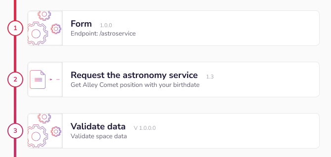
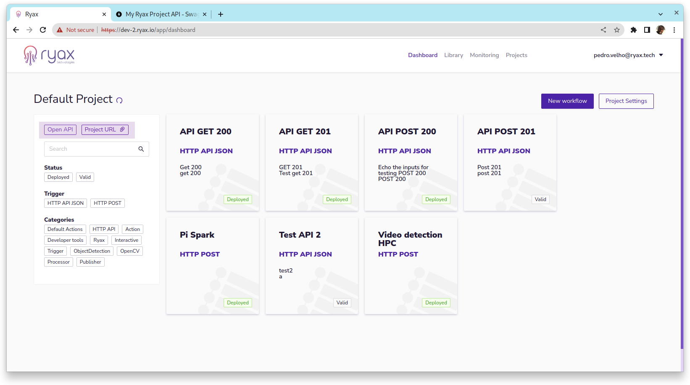
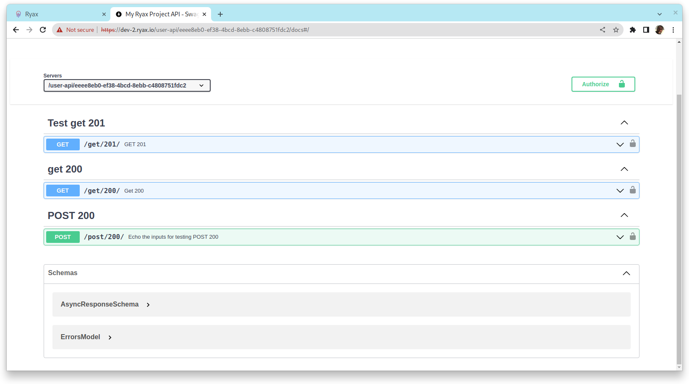
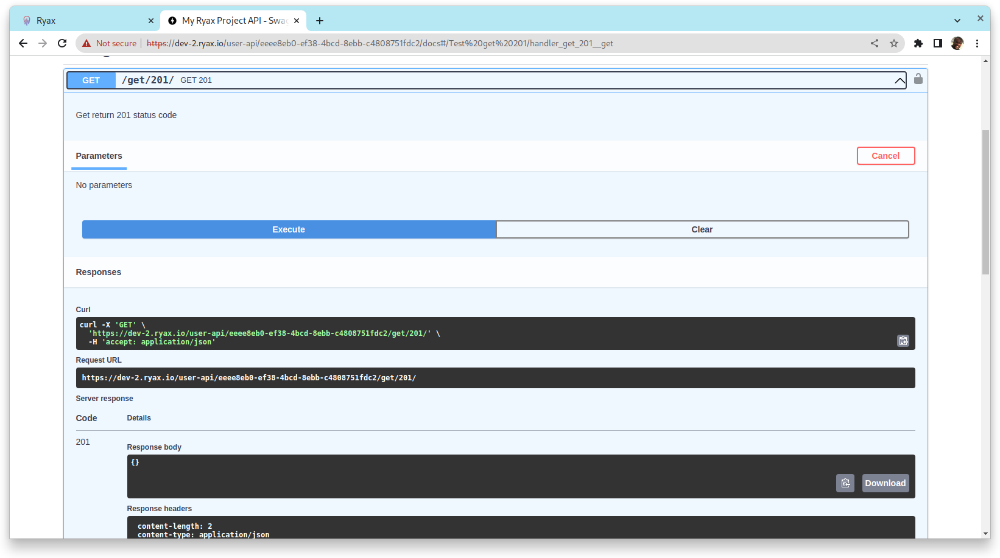
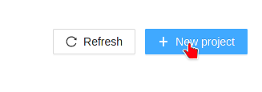
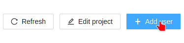

# Concepts of Ryax

## Workflows, Actions and Runs

Ryax is more than just a tool; it is a complete framework to develop, deploy, and maintain backends. To do so, Ryax proposes a paradigm. To fully understand the framework, in this section we will go through the main concepts in Ryax: workflows, triggers, actions and runs.



The above is a snapshot of a *workflow*. A workflow is a chain of computational steps that can serve diverse purposes. Each of the subsequent numbered boxes are called *actions*. These are the units of computation that take some inputs (or none at all), and can produce outputs. Linking multiple actions together gives us a workflow.

**Workflows are**:

- a set of linked actions.
- without any loops; they are Directed Acyclic Graphs (DAGs).
- data streams; the outputs of any given action are accessible to every downstream action.

There are 2 types of *actions*:

- **Triggers** are the actions that ingest data from the outside world or are triggered by any internal or external event and will begin the run of a workflow. They are long-running processes responsable for triggering new workflow runs. For example, a trigger can start a new run every day at 6 pm; or every time that an email arrives in a given mailbox.
- **Actions** are stateless processes that compute *things*. They ingest data from upstream through their inputs and produce outputs which are added to the stream and can be used doenstream.

An action computing some data is called a **run**. In Ryax, a run holds everything related to it: the input data, the output data, the logs, etc.


### Creating a Ryax workflow

To create a Ryax workflow, answer these questions:

1. *What triggers the workflow?* Many events in the outside world may trigger a Ryax workflow. It can be an email, a new file in a file share, submission of an online form, a new contact in a CRM or some IoT data, for example.
2. *Who needs the results of the workflow?* What are the tools they can access? For instance, a salesperson may need this data to be attached to the company profiles in a CRM, or predictive maintenance results may need to be accessed by managers to plan actions and by workers to perform the recommended actions.
3. *What data do you need to be able to run the required computations?* Where do you gather it? In what formats do they come?
4. *Are my computations done in several steps?* Are there some steps that I can reuse in other workflows? Can I salvage actions from prior workflows?

The first question helps define triggers. The second one is for actions.
Finally, 3 and 4 help define re-usable actions.


## Triggers

In Ryax, you can define your own trigger to fit your needs.
For example, listen to a message broker topic, connect to your system and respond to any event 
coming from it. Simpy put, triggers are the first action of a workflow responsible for
initiating Ryax executions.  
For common tasks, like 
periodically launch executions, launch from a form or API call there already triggers
available. For a comprehensive list of triggers check the [default-actions project triggers section in gitlab](https://gitlab.com/ryax-tech/workflows/default-actions/-/tree/master/triggers).

### API HTTP JSON

This trigger implements a JSON HTTP API, this trigger will provide an API endpoint on the   
project URL associated to your Ryax Project. For your convenience an OpenAPI doc is automatically
generated and can be accessed from the project dashboard. You can see `OpenAPI` and `Project URL` links
just below the project name.



In the OpenAPI doc you can have an overview of the project endpoints, each endpoint is
a different workflow that implements trigger `HTTP API JSON`. The fastest way to secure 
your endpoints is to click on `Project Settings` and associate an API key to your project.  



You can use the OpenAPI doc to interact with your endpoints and check the full URL.



The `API HTTP JSON` trigger allows you to set several parameters including the OpenAPI
summary, tags, description, method, timeout, and the success code. Users can choose either
as success status code 200 (http success) or 201 (http created). Code 202 (http accepted) is reserved
by Ryax, because if a timeout occurs, Ryax returns 202 with a link on the payload to
fetch results. If you want to achieve an immediate asynchronous API call, just set timeout
to zero. This will instantly return 202 with a link on the payload to fetch results.
See an example of response payload when 202 is return below.

```json
{
  "result_link": "https://dev-2.ryax.io/runner/results/WorkflowRun-1688476847-cxev",
  "workflow_run_id": "WorkflowRun-1688476847-cxev"
}
```

Any subsequent action of a workflow with HTTP JSON API trigger can raise a `RyaxException` on
the handler function. `RyaxException` carries 2 parameters message and 
code, names must be respected, to allow users customize the HTTP error status
code and message. See the example below.

```python
# Names RyaxException, code, and message must be exact
@dataclass
class RyaxException(Exception):
    message: str
    code: int

def handler(inputs: dict) -> dict:
    output_dict = {}
    user = inputs["user"]
    try:        
        return output_dict[user]
    except KeyError:    
        # RyaxException sets HTTP JSON API response's payload and status code
        raise RyaxException(code=404, message=f"User {user} not found")
```


For a complete action example, see [raise_ryax_exception](https://gitlab.com/ryax-tech/workflows/default-actions/-/blob/master/actions/raise_ryax_exception/ryax_handler.py)
action on the `default-actions` repository.

## Projects

In Ryax, a **project** groups and controls the visibility of workflows, actions, runs, repositories, and users. All resources within a project are only visible to users that are associated with that project.

Projects help you organize your resources allowing you to show only the relevant workflows, actions, and repositories for a group of people. This type of organisation can significantly improve the user experience and can be done in a variety of ways, for example:

- split teams across different projects, so each team has only access to what is relevant to them.
- group all your workflows by theme, client, or any relevant aspect you might think.
- separate test and production-oriented projects so developers and users have more freedom to experiment.
- create a personal project for each user, so they are free to learn and test Ryax.

A user can be associated with several projects, and a user is required to be associated to at least one project. If the current user is in more than one project, the  **Projects** menu appears on menu header of the UI.

Administrators can see all projects and assign users to many projects. Be careful, in some situations a user may end up being assigned to no project at all; in this case, the user will be unable to see any resource in Ryax. If this is the case ask an administrator to assign a project.

To create a project, you have to be an administrator. Click on the top-right User menu and go to the Admin UI. Then select the "Projects" menu, then click on the "New project" button in the top-right.



To assign users to a project, click on the project name on the same page, and then click on the "Add user" button.



At the moment, Ryax cannot migrate resources (like a workflow) from one project to another. If you need to do that, you can export the resource and import it to the other project.

## Sites

In Ryax a **site** is defined as a set (or cluster) of computing resources managed by the same orchestrator (such as Kubernetes, Slurm, etc). Ryax supports the execution and management of Actions upon multiple sites. 

The definition of the available sites per Ryax instance is done by the admin see [Enable Multi-Site on Ryax](../howto/worker-install.md)
The selection of which site will perform the execution of each action can be either set by the user as a *constraint*, to express a specific "hard" demand regarding the placement or automatically selected by the Ryax scheduler, based on a "flexible" demand expressed by the user through the configuration of *objectives*.
