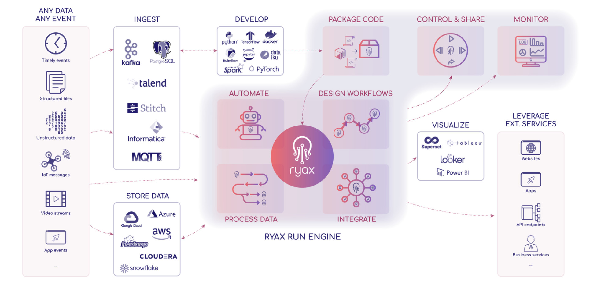

# Introduction

Ryax is a compute and workflow management platform which: enables the execution of data analytics apps (ETL, AI, LLM,..),  
optimizes the computing resources utilization (CPU, GPU, RAM) and provides a smart orchestration to enable an efficient and cost-effective deployment 
of AI workloads across any infrastructure (Cloud, On-Prem, Edge, HPC).

Ryax is a low-code, API-first, AI-driven workflow management system for data analytics. It provides the means to create, deploy, update, execute and 
monitor the execution of data processing workflows on hybrid Cloud, Edge, on-premises and  HPC computing infrastructures. It enables users to create their 
data automations and expose them with APIs through fully customizable workflows using a low-code UI. It makes use of a powerful, hybrid serverless/microserverices-based runtime, 
abstracting completely the complexity of building and deploying containers with their dependencies upon Cloud infrastructures. The software platform has been designed 
with a focus on data analytics and offers a variety of built-in features and a repository of various integrations to facilitate users in the process of 
industrializing various types of applications integrating complex data automations.

## Ryax Main Advantages

Ryax compute and workflow management platform offers the following advantages:

- **Flexibility & Transparency** to facilitate the design and execution of AI workflows by offering an intuitive and accessible platform which abstracts 
the complexity of deploying AI/ML/LLM-based workloads and monitors their computing resources usage.
- **Smart Orchestration** to reduce costs and energy consumption while keeping high performance of executions by 
providing multi-constraint and multi-objective-based allocation of resources on hybrid infrastructures
- **Computing Resources Optimization** to maximize the usage of CPUs & GPUs, by leveraging cutting-edge technologies such as Autoscaling, Dynamic GPU Fractioning & Bin Packing, 
and combining AI-powered techniques.

## Ryax Principal Functionalities

Ryax provides the following important features:

### Reproducible Environment packaging (Container creation)

Environment packaging abstractions based on NIX functional package manager -> Users bring their code and Ryax builds the containers (multi-arch, polyglot).
The build process is fully reproducibile thanks to the ryax lock file.

### Runtime engine

Custom, hybrid microservices, serverless engine capable to deploy data analytics, AI, HPC apps on all type of hardware providing the right amount of resources 
(RAM, CPUs, GPUs, Duration, etc). Deploy apps based on a powerful custom serverless pay-as-you-go runtime agnostically using any K8S-based infra (Edge, Cloud, OnPrem) 
and any type  of arch (x86, ARM, GPUs)

### Workflow View

View and control of apps as workflows composed of different individual components (more intiutive design, more controlled and optimal execution) 

### Logging, Debugging, Monitoring

Capabilities for logging, Debugging and monitoring of the remote executions of containers

### Multi-site seamless execution

Multi-site support for seamless workflow deployment upon the hybrid cloud (Infra agnostic, no vendor lockin, deploying upon all types of K8S distributions) 

### Multi-constraint and multi-objective scheduling 

Optimal orchestration of application executions through multi-constraint/multi-objective scheduling techniques across the continuum 

### AI-driven resource optimizations

Resource optimizations based on AI-driven techniques combining Kubernetes Vertical Pod Autoscaling, Bin Packing (and Dynamic GPU Fractioning) brought 
through VPA-pilot functionality  

### HPC offloading

Seamless execution of compute-intensive data analytics applications on HPC through offloading on external HPC schedulers 

### Multi-infra observability

Logging, Debugging and monitoring of the multi-infra executions including HPC

### Serverless CPU/GPU

Deploy apps based on a powerful custom serverless pay-as-you-go runtime agnostically using any K8S-based infra (Edge, Cloud, OnPrem) and any type  of arch (x86, ARM, GPUs) 

### Bin Packing

Allocate resources in a dynamic way, based on AI-powered techniques leveraging historical workload execution data, to maximize CPU/GPU/RAM usage.

### Smart Scheduling

Optimize workload placement to minimize execution time based on various policies to address both event-driven and batch computing.

### GPU Fractioning

Distribute multiple workloads from various applications & users on a single physical GPU divided into multiple virtual GPUs. 
Resources recommendation with Ryax Intelliscale for GPU version based on dynamic GPU-Fractioning (ML-based).

## Ryax Roadmap and upcoming features

The following list is not exhaustive but shows a portion of the new features to appear in the upcoming releases:

- Environment packaging improvements through Ryax CLI build extensions
- Tighter integration of services within Ryax
- Resource Accounting and Quotas Management
- Multi-Cluster Scheduling Optimizations (more efficient techniques, new objectives, etc)
- Single-Cluster Scheduling Optimizations (Limit starvation, improve Bin Packing, improve cold start, etc)
- Integration of Keycloak for single-sign on and support of OpenID, OAuth 2.0
- Ryax Intelliscale optimizations (techniques to limit OOM kills)
- Automated provisioning of resources based on Infrastructure from code techniques (Pulumi, Nitric)
- Support of new types of deployments (lightVMs, unikernels, VMs, etc)
- Tight integration with WebAssembly 
- Increased internal network Security (mTLS, NetworkPolicy)
- Support of intermittent connectivity for Edge deployments

## Ryax background, motivation and added value

The Workflow Management system is responsible for the automation of orchestration and execution of task collections upon computational resources. 
A common pattern in scientific and cloud computing involves the execution of different computational and data manipulation tasks which are usually coupled i.e., 
output of one task used as input on another. Hence, coordination is required to satisfy data dependencies. The task execution is handled by the system and can be 
distributed among the underlying available computational resources. Consequently, this introduces further complexity on the system side, related to processes such as load 
balancing, data storage, data transfer, tasks monitoring and fault-tolerance. Furthermore, on the application side, workflows provide an end-to-end view of the processing 
rather than focusing on a specific part of the computation which allows users to control the full process by abstracting the complexity of how each task is executed. 
Automation of the aforementioned aspects of the orchestration process along with the complexity abstraction has led to the creation of workflow management systems.

The Ryax platform abstracts the complexity of:

1. developing data analytics pipelines by using workflows requiring developers only to describe the structure of what 
   will be deployed, and how it will be connected through a simple to use, intuitive web interface and visual programming tools connected to a YAML- based declarative design ; 
2. building the environments to be deployed with the necessary dependencies through built-in internal mechanisms based on Nix functional package manager, 
3. deploying and monitoring containers through a fine-integration with Kubernetes orchestrator and iv) providing various types of execution optimizations through optimal management of
   resources while combining various features such as efficient autoscaling capabilities based on built-in 
   resource management techniques considering the request demands and combining both Horizontal Pod Autoscaling (Kubernetes) and Cluster Node Autoscaling (Cloud Infrastructure provider). 

Ryax, through its design and abstractions offers a unified handling of batched and streaming data definitions to cover processing of both bounded and unbounded datasets, 
which makes it an attractive engine for hybrid AI/Big Data/HPC applications.
