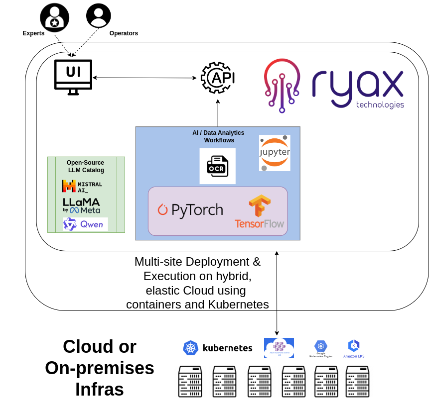
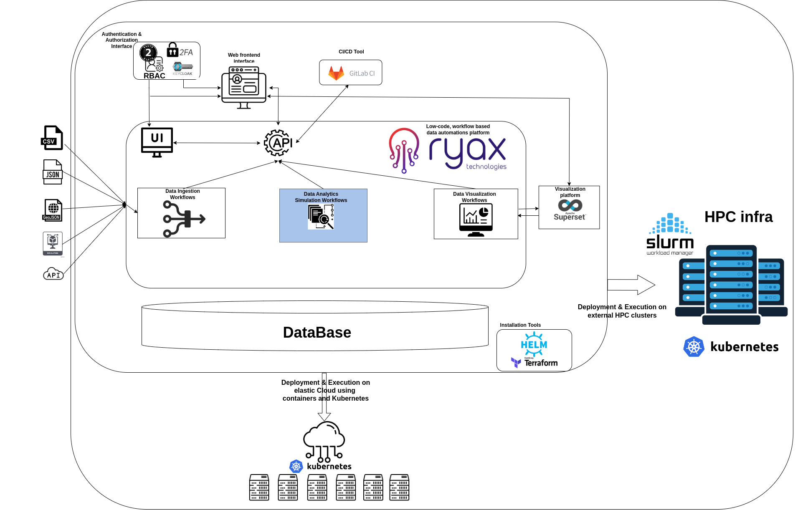
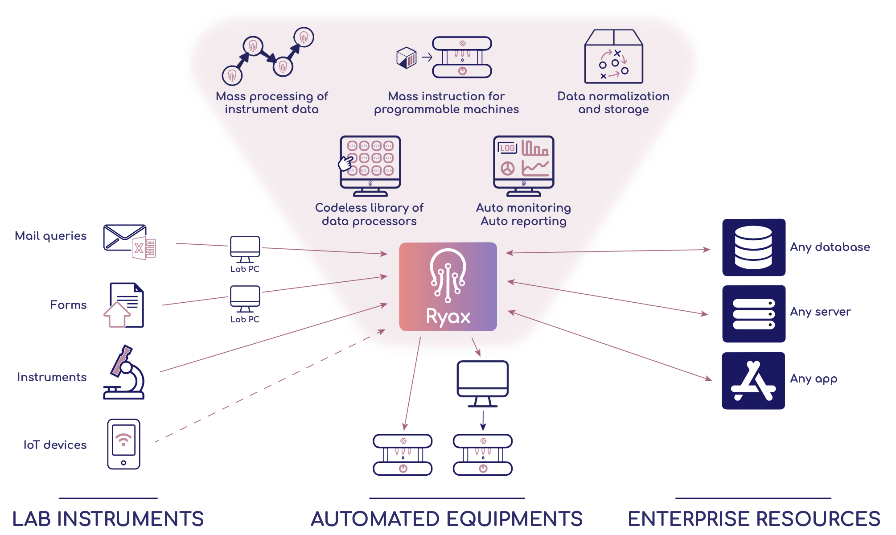

# Use cases

Following are a few concrete examples of what Ryax is capable of, but keep in mind this list is non-exhaustive, and does not come close to detailing all the 
potential use-cases Ryax can cover!

## Fintech domain and Companies Financial Analysis

In this use case Ryax plays the role of the data-analytics platform to handle the different data treatment needed for the particular application. In particular, 
different workflows can be used to perform the extraction of specific metrics out of various financial documents. This can be offered 
based upon open-source Large Language Models using the serverless GPUs feature of Ryax and it can be deployed upon multiple sites to take advantage of powerful GPU node-pools. 

Other Ryax workflows may perform the real-time ingestion and visualization of stock exchange data. Finally, both the frontend and the backend are deployed and hosted as services upon Ryax 
which can facilitate the work done by the operators of the application. The particular use case will show a substantial decrease for LLM utilization costs when compared to typical usage since
the Serverless GPU technique allows the utilization of GPUs for only some minutes instead of complete hours. 

## Precision Medicine domain and Simulations-based applications

In this type of use case, Ryax can play a crucial role for the migration of an HPC application to the Cloud and hence offer unlimited elasticity to a rather rigid application. By adapting the application
to run on Ryax platform it is transformed to an application which can be seamlessly executed on both Cloud and HPC types of infrastructures. This is becoming more and more interesting since applications incorporate AI/ML parts which are typically run on the Cloud but can also leverage HPC infras for performance benefits.

The application can be decomposed into different workflows from data ingestion getting data from different sources, to data visualization connecting with particular visualization platform, along with the more compute-intensive ones related to precision medicine statistical simulations which can be all controlled through Ryax platform. Furthermore different types of databases can be used to store the data in their different stages and this database can be either deployed on the underlying Kubernetes cluster or used as a service from an already deployed and externally managed provider. Finally Ryax can be used to host the frontend user interface and enable communications with the backend through the REST-API endpoints which can be created to control the different data analytic workflows.

## Data Analytics PoC and MVP

Users can take advantage of Ryax abstractions to develop data-analytics apps quickly. It is well suited to create Proofs-of-Concept (PoC) and Most-Valuable-Products (MVP). Users can leverage a library of 
existing Actions and Triggers, as well as develop specific ones for their project, giving them a fast-track to a working piece of software.

## Creating API-first backends

Without any knowledge in web server, hosting, or HTTP request handling, users can still create web-based applications with Ryax API-first applications. 
By leveraging the "API endpoint" trigger, workflows triggered by HTTP endpoints can be created in a few clicks.

## Automate daily tasks

At its core, Ryax is a powerful workflow automation tool. Thus, users can create automation to speed up their daily tasks, whether those be small-scale, 
or large-scale industrial tasks.

## Data Industrialization

Ryax can be used to operate complex event-driven streaming data flows, commonly used in Industrial IoT or other Manufacturing 4.0 applications. 

Popular use-cases usually involve collecting data from various machine sensors in real-time, cleaning it, filtering it, injecting it into a processing algorithm, 
and outputting valuable results as quickly as possible.

Predictive workflows are widely used in industrial contexts to anticipate machine failures, production peaks, or plan maintenance. Ryax is well suited for this kind of application.

## Lab Automation

Laboratory Automation is a key topic in various lab-powered industries such as pharmaceutics, healthcare, biotechnologies, cosmetics, etc.

Supported by the right tools and processes, lab automation endeavors can deeply transform businesses and enhance their performance in many operational fields. 
Ryax is helping laboratory teams collect, clean, and crunch experimental data to extract its full value potential.

Another main use for lab automation is "lab industrialization": Ryax allows for full connectivity of lab equipment with IT ecosystems (even in remote anddistributed contexts). Automatically generate and schedule instructions for all your laboratory equipment!

Gathering information from a wide range of sparsely connected data sources is a whole challenge in itself, though mandatory in a laboratory context where many systems coexist. The Ryax platform makes it simple to interconnect tablets and portable devices, dedicated instruments such as microscopes, oscilloscopes, various analyzers, specialized operating equipment like ultracentrifuges, diluters, and of course: Lab computers.

Such data pipelines may occur across highly-distributed infrastructural environments where data from remote laboratories needs to be processed locally and then reliably upstreamed to various locations including other labs, customer-specific databases, data lakes, and central clouds. The Ryax platform abstracts these infrastructure layers and ensures robust and predictable data governance over the whole chain.

Efficient use of company resources is the last key pillar of such endeavors. Making sure workforces can decrease time spent on low-value workflows and foster valuable initiatives instead is essential to the sustainability of any lab project. Ryax natively provides a collaborative framework for lab teams to further elaborate lab processes together and benefit from each other's skills and best practices. Companies can build an 'action catalog' in the Ryax Store, whcih is comprised of many built-in (no code needed) actions, as well as internal actions any lab technician can use, reuse, and share to build efficient data processing workflows.
