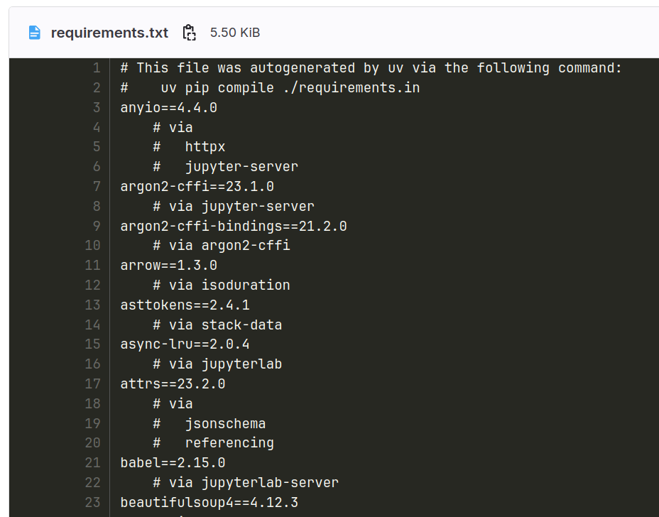
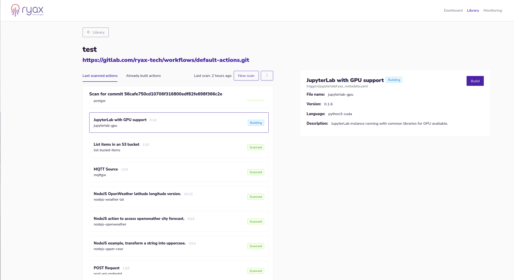
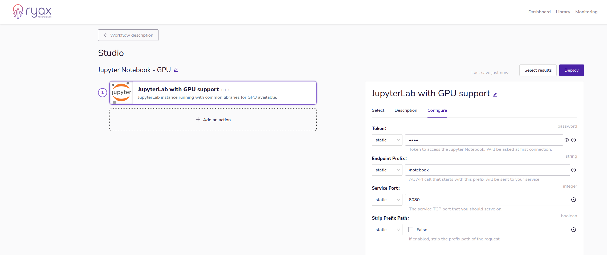
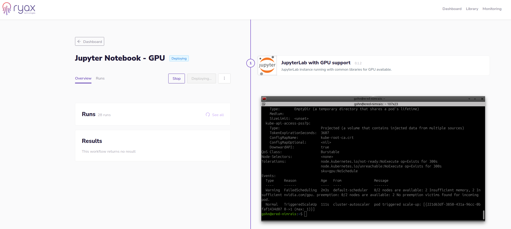
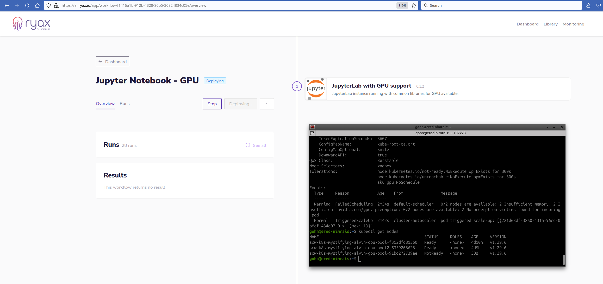
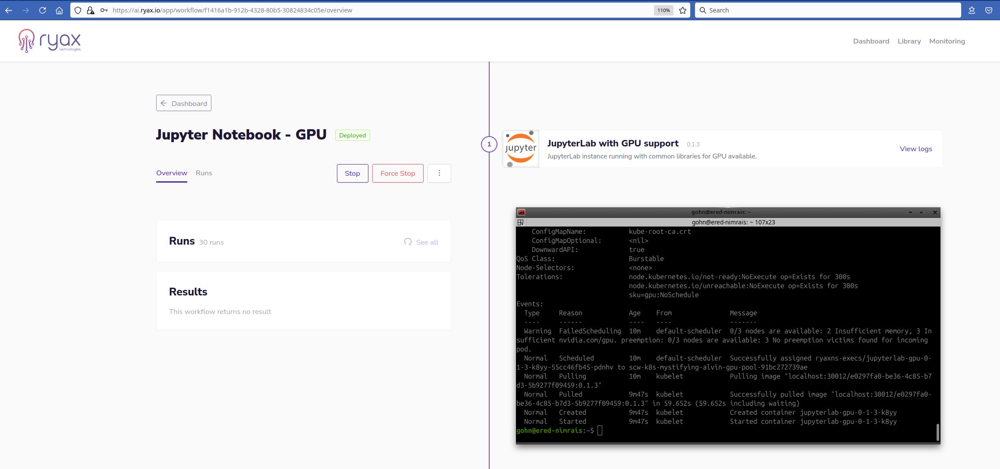
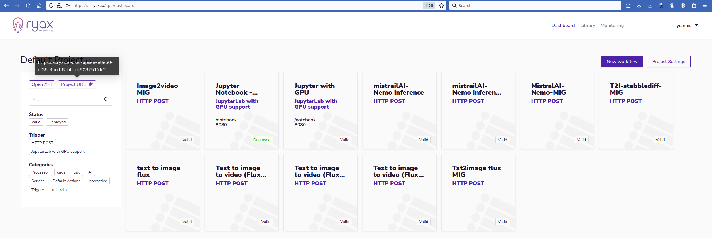
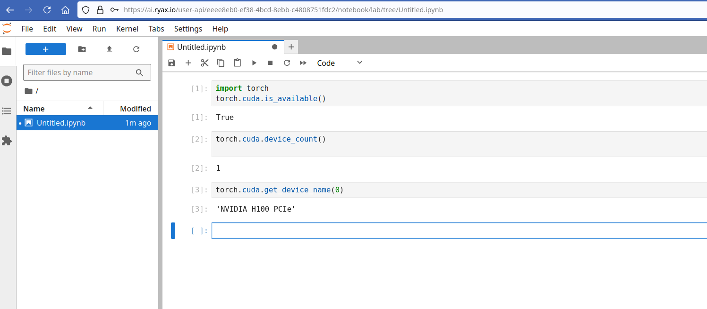

# Deploy a Jupyter-Notebook using the Serverless GPU feature

This tutorial provides some details on how to make use of Ryax to deploy a Jupyter-Notebook leveraging the Serverless GPU feature.
In particular we will see how a user can simply provide the dependencies needed for the Jupyter-Notebook, demand a GPU resource, build the action within Ryax, deploy a simple workflow and make use of a remote GPU through the Jupyter-Notebook.   

## Dependencies and resources definition

Initially the user needs to define a `ryax_metadata.yaml` file providing the dependencies and resources demands along with various other high-level parameters. 

```yaml
apiVersion: "ryax.tech/v2.0"
kind: Source
spec:
  id: jupyterlab-gpu
  human_name: JupyterLab with GPU support
  version: "0.1.6" # update the version
  logo: "logo.png"
  type: python3-cuda
  description: "JupyterLab instance running with common libraries for GPU available."
  categories:
  - AI
  - Service
  dependencies: # dependencies referenced nixos.org 
  - nodejs_21
  - python311Packages.opencv4
  - libglibutil
  - poppler_utils
  - tesseract5
  - libGL
  - glibc
  - glib.out
  addons:
    http_service:
      port: 8080
      endpoint_prefix: /notebook
      strip_path_prefix: false
  resources:
    gpu: 1
    memory: 40G
    cpu: 4
  inputs:
  - help: Token to access the Jupyter Notebook. Will be asked at first connection.
    human_name: Token
    name: token
    type: password
  outputs: []
```
In particular, concerning the resources demand we can define what is needed under the resources paramaters as shown previously where we demand 1 GPU resource along with 4 Cpus and 40G of RAM. 
Concerning the dependencies the user needs to provide the high-level packages to be used by our internal build system based on Nix functional package manager. Similarly to how we install packages through "apt install" for Ubuntu 
since in Ryax we make use of Nix system we need to provide the Nix related dependencies for the libraries we need. This said we can also make use of the dependencies related to the particular programming language dependency system. In this case for 
Python we can also provide the relevant requirements.txt file.




We need to note that the Jupyter-Notebook needs to be deployed as a Service meaning that it will
remain in running state as long as we need it, until we decide to Undeploy it. For this reason it is defined as a trigger hence with "kind: Source" as we can see.
Once resources and dependencies are defined we need to provide the code which will run the service of Jupyter-Notebook. This is typical and we can see an example for that in the publicly available version of the trigger under: https://gitlab.com/ryax-tech/workflows/default-actions/-/tree/jupyter-tests/triggers/jupyterlab

Once all the files for our action are ready we can scan our git repository and build the action directly on the Ryax platform.



## Workflow creation and configuration

Once the trigger is built and is available in the action library we can create our workflow which will be simply composed by the created Jupyter-Notebook trigger. Then we can configure our workflow by adjusting the different related parameters. 



When the parameters are set we can Deploy the workflow by clicking on `Deploy` button at the top right of the screen.

## Workflow Deployment

The deployment and execution of the workflow start simultaneously and since the trigger specifically demanded for a GPU, making use of the Ryax serverless runtime, the underlying orchestrator Kubernetes will need to provision one GPU node. As we can 
see in the following screenshot by the moment the pod appears in the system, the Kubernetes scheduler triggers its node autoscaler to scale-up the gpu node-pool to allocate the GPU and execute the pod there. 



The particular deployment is done in the Cloud and what is interesting is that the gpu-node was not reserved until the demand appeared. In particular the gpu-pool has been configured with autoscale activated hence whenever the need appears the node is 
provisioned and once no Ryax workflow needs the node it is autoscaled back to 0. Hence the user pays only for the time the GPU is actually used. In the case of on-premise instance the GPU can be shut-down to minimize energy consumption or 
it can be used for other type of services. The serverless runtime of Ryax allows it to reserve GPUs for the time needed, which is an important advantage when compared to the typical serverless services
(such as Amazon Lambda, Google Cloud functions, etc)


Eventually the node appears but until the moment it becomes Ready the execution remains in the `Deploying` state.


Eventually, the node appears, the pod passes in `Running` state in Kubernetes and the workflow is `Deployed`.

## Using the deployed Jupyter-Notebook service

Once the workflow is `Deployed` the user can start using the service directly through the browser by using a particular http endpoint. Ryax exposes the Jupyter-Notebook on a specific http endpoint which can be found by clicking on the `Project URL` 
button at the top left.



The complete endpoint needs to be completed by the prefix given in the configuration parameters of the action in the initial phase before the deployment of the workflow. In the particular case we have used `/notebook` prefix. We can copy that http
endpoint in the browser and we will see the initial page of the Jupyter-Notebook service. This will bring us to the page which demands a token to connect.


For that we need to use the password token we provided in the configuration parameters of the workflow. Once this is given we will get access to the environment of Jupyter notebook ready to deploy our code upon the underlying resources.



A simple example using some basic torch functions to display the underlying resources shows the allocation of an NVIDIA H100 GPU. 


## Deploying the Jupyter-Notebook on an HPC cluster 

Following the previous technique of deploying Jupyter-Notebook on particular resources on a Kubernetes cluster, Ryax can also enable the offloading of this service to an HPC system. This allows a non-HPC expert to leverage HPC resources 
through a Jupyter-Notebook upon which she will have access through an http endpoint in a similar way to what has been presented previously. The technique for HPC-offloading of the Jupyter-Notebook will be explained in another tutorial but the code
is already publicly available under https://gitlab.com/ryax-tech/workflows/jupyter-trigger


