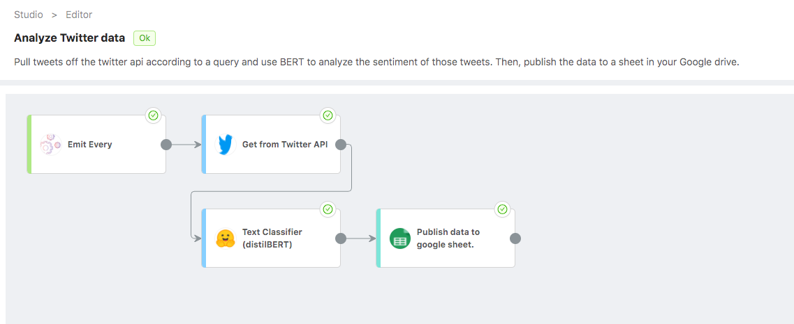
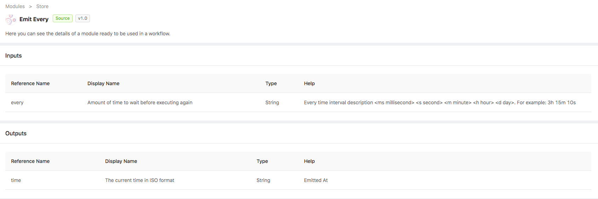
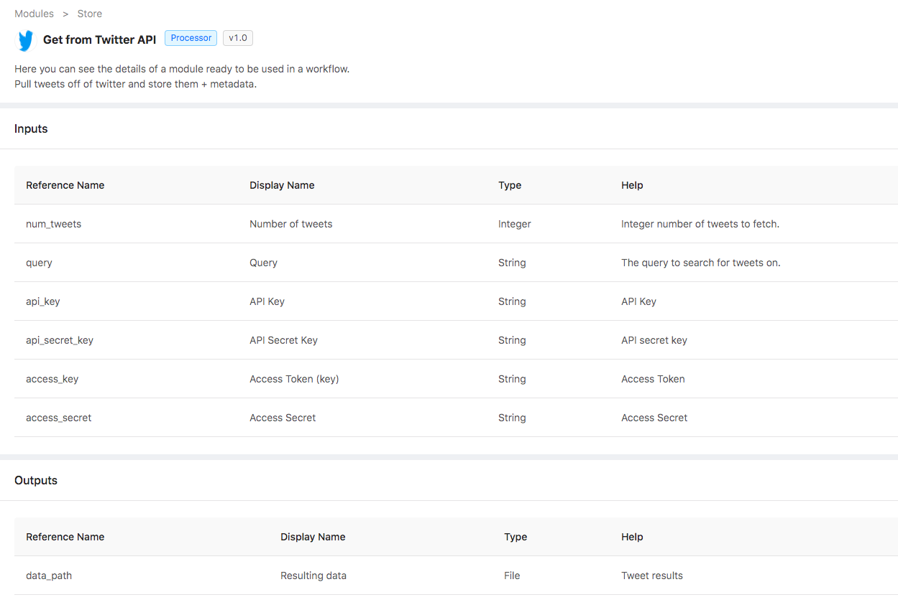
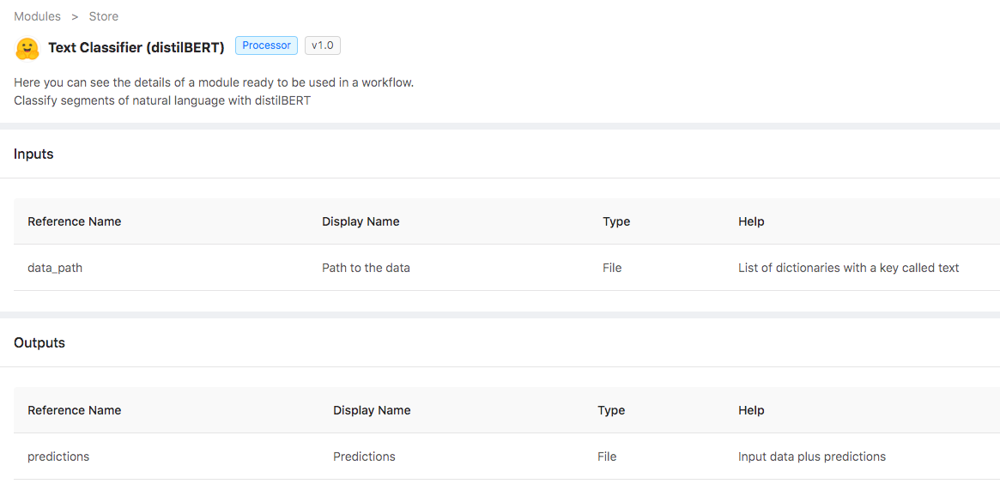
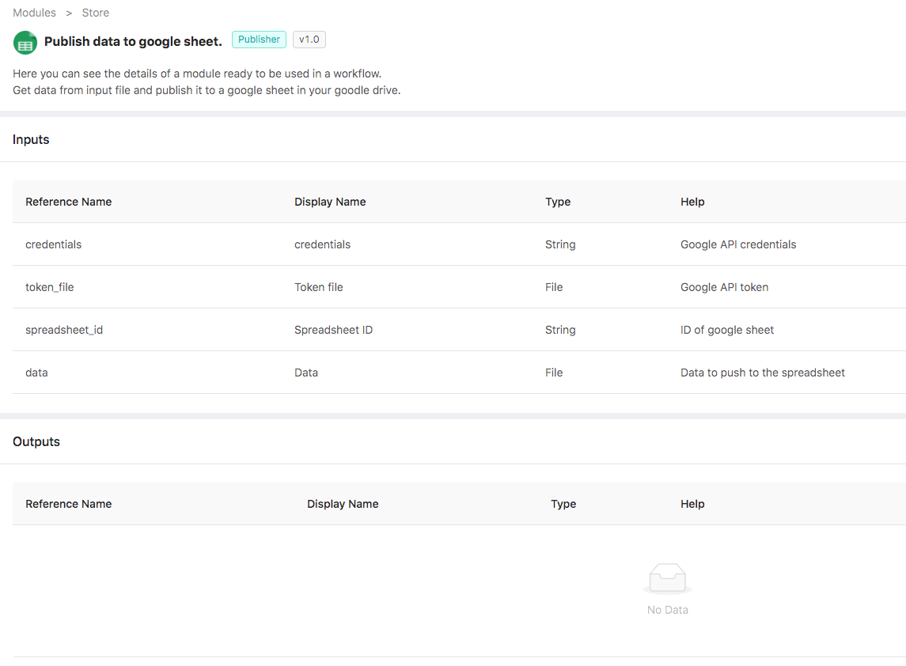
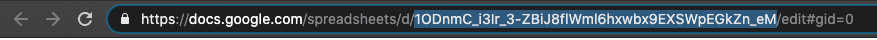

# How to perform Sentiment Analysis on tweets

The following how-to reviews a Ryax workflow to do sentiment analysis on Tweets, and how to reproduce such an experiment.

We will see how to package up a state of the art BERT language model in it's own container, and connect this to two different external APIs (Twitter and Google) with very little user code required.

First we will take a look at the example workflow and explain what it does and how. Then, we will go through each individual module and show how they may be easily extended for more functionality.

## Birds-Eye View

Let's begin with a global view of the workflow. Here is a look from inside the Ryax workflow studio:

#### What does this do?

From only the previous image it may be clear what this workflow does. Here's the rundown:

1. Trigger an execution every so often (defined by the user) with the "Emit Every Gateway"
2. Pull a user defined amount of tweets and tweet metadata off of the twitter API according to some query, organize them and store them.
3. Take the data from the tweets and use an off-the-shelf DistilBERT model (fine tuned for text classification) to evaluate the sentiment in those segments of text. Then organize this data and pass it along.
4. Take the scored data and publish it all in a stuctured manner to a Google Sheet.

#### Why is this interesting?

There are a few key points about this workflow that make it appealing from a business perspective:

* We can easily leverage two different external APIs in this workflow to get value out of data and into the hands of our team.
* Once running, no maintenance is needed unless functional changes are desired. The workflow can be scheduled to run as much as the user defines. In this way, once it's set up, no more babysitting is needed and all the results can be accessed directly through the Google Sheet.
* As we will see, adapting this workflow to do different things is very easy, as the modules are not bound to eachother, and any additional data requirements can be added with a few lines of code.

Now, let's take a look at each module in a bit more detail.

## Emit Gateway

A 'Gateway' as we call it in Ryax, is any module that kickstarts a workflow.

This particular gateway is called `Emit Every`, since it is designed to "emit" or launch an execution "every" so often.

It has one input; a string to define a temporal quantity denoting how often it should wait to trigger a new execution.

For example, the input `1d3h5m` would trigger an execution every 1 day, 3 hours, and 5 minutes... More precisely every 1625 minutes.

We can see these details from within the Ryax function store:

## Twitter Module

The first module in our workflow is designed to fetch some amount of tweets from the twitter API, according to a user-defined query.

In the Ryax module store we can see more details about the I/O.

As we can see, this module requires a few things to boot up:

* Number of tweets: how many tweets should we process at once?
* Query: this is a string which we use to search for tweets. If a hashtag, or a hashtag plus some language is desired, just use a `#` in the query.
* Credentials: To use this module, one must necessarily have a twitter account. With this, anyone can go to [Developer-Twitter](https://developer.twitter.com) and get credentials to access the twitter API through their code. This input is a file with your credentials exactly as twitter gives them. In your workflow definition, give the relative path to where you have stored this credential file (in JSON)

The module will return the path to a file where it has stored the retrieved data.

## Sentiment Analysis

We are developing several NLP modules at Ryax. This one is simple but very powerful. Let's take a look in the studio:

This module shows an NLP use case called Text Classification (sometimes called sentiment analysis). It takes segments of text as input, and will attempt to predict wether the text is saying something positive, or negative, along with a confidence score.

This module does not need to work with tweets at all. As such it extends to all kinds of NLP use cases so long as the algorithm needed is sentiment analysis, and BERT (specifically distilbert fine tuned for text classification) is deemed appropriate for the task (as of October 2020 it most definitely is).

You can check out the model as well as some of its siblings at [Huggingface](https://huggingface.co/transformers/pretrained_models.html). If you're familiar with python, it will be easy to replace the defualt model with another from the Huggingface library.

The module takes as input a file with text data stored (hint, this was the output of the previous module), and outputs that same data by writing to either the same or a different file, labeled with a binary prediction, and a confidence score.

In this case a prediction is two things:

1. Prediction: this will be a binary value, either `POSITIVE` or `NEGATIVE`
2. Confidence: the probabilistic confidence of that prediction (closer to 1 means more certain of the given prediction, while 0.5 is completely uncertain)

## Publish to Google Sheet

The last module in this workflow takes any data we send it, and as long as it is structurally sound, publishes it to a google sheet.

Again, let's have a look in the studio:

Like with the twitter module, this module requires a little extra push to get moving. The inputs are very straightforward, but for this one you'll need to generate a token for your google account. We will tell you how to do so right away and then move on to the module description.

Here are the steps to get this module in production:

1. Clone or download the code in [this repository](https://gitlab.com/ryax-tech/workflows/google-modules). This is the source code for the module.
2. In a browser, go to [this url](https://developers.google.com/sheets/api/quickstart/python). FOLLOW ONLY STEPS 1. This will allow you to use the google api. Please select to save the credentials file locally. PUT THIS FILE INTO THE SAME DIRECTORY AS THE CODE DOWNLOADED FROM STEP 1, it should be called `credentials.json`. The contents of this file will later be copied and pasted as input to the module. 
3. Open up a terminal and navigate to the directory where the code you downloaded from step 1 exists. Ensure you have python3 on your machine, and run the following command: `pip3 install --upgrade google-api-python-client google-auth-httplib2 google-auth-oauthlib numpy`.
4. In that same terminal window, run the following command: `python3 handler.py`. This program will direct you online, where you will need to click allow to be able to update your google docs. NOTE: In some cases, you may get a warning that the site is unsafe, but to continue from here you must click proceed. This is due to the fact that you are using an app created by your google credentials that google itself is not verifying, trust us, it will be safe).
5. Ensure the presence of the `token.pickle` file in the current working directory, alongside `handler.py` and `ryax_metadata.yaml` (as well as other files perhaps, but these two are the only ones we are interested in).
6. Build the module in Ryax! You can do so either by pushing the code you downloaded (with the added token file) to a repository of yours, to a new branch in our public repo, and then scanning it in the Ryax UI, or by using the CLI and uploading it directly from your file system. 

You did it! Here are the specific usage details for once the module is in Ryax:

Both the credentials and the token file are inputs to this module. If you followed the steps above, then you can simply copy and paste the contents of the `credentials.json` file into the webUI `credentials` input parameter, and copy and paste the name of the token file with extension (typically just `token.pickle` unless you changed it) to the webUI `token file` input parameter (remember, the file must have been uploaded in the same directory as the handler.py when you built the module!)

Then, you can either create a new google sheet or take the ID of an existing one to use as the `spreadsheet ID` input parameter. For this you'll need to go to your google drive, and once a google sheet is created, take the ID from the URL. Below is an example of how to locate it in the URL:

In the above picture, the highlighted portion of the URL is the ID that you will use as input!

One special thing about this module is that it uses an internal python module from Ryax called `ryax_google_agent`, where we have and are continuing to develop google API methods. In this case, we have out own internal representation of a google sheet that can be manipulated. This makes it really easy for the user to have different interactions with the google API by changing as little code as possible. For example, would you like to overwrite the entire sheet every time this module is run? Ok fine, that's a one word change, from an `GoogleSpreadsheet.append()` function call, to a `GoogleSpreadsheet.update()` call in the code.

There you go! This module will perform a simple print in the logs showing return message from the google API when executed. You should see that google sheet update upon execution!
