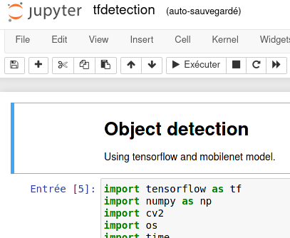
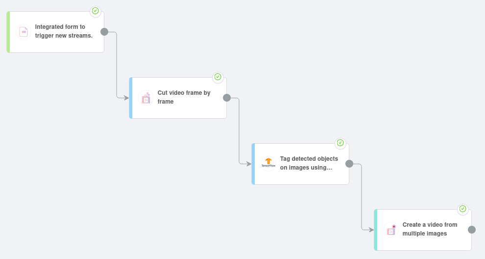

# Run a Video Detaection in Jupyter-Notebook


Many developers, analysts and data scientists use [Jupyter Notebook](https://jupyter.org/) to develop new algorithms.
Here, we will walk you through all the steps required to move your code from the Notebook to a production-ready environment: the Ryax platform.

!!! tip
    This guide assumes that you are already familiar with the Ryax platform. If not, please follow the [tutorials](../tutorials/quick_start_guide.md) first.

## What do we want to achieve?

We want to create a service that detects objects on a given video.

As we go down that path, we recommend answering the [4 following questions](../concepts/concepts.md) that help designing Ryax workflows:
1) *What triggers the workflow?* In our case, users will send their video using an online form.
2) *Who needs the results of the workflow?* Here, only a Ryax user wants to access the final video.
3) *What data do we need to run the required computations?* We have one main computation: an algorithm that detects objects on an image. It needs to access images, then output the same images with the detected object circled and named.
4) *Are my computations done in several steps?* Even if the selected algorithm has several steps, we don't see how splitting it will make it more re-usable: let's keep it as a single workflow step.

As a conclusion, we will need the following actions:
- a form source
- a processor able to split a video frame by frame
- the algorithm detecting objects on images
- a processor that creates a video from a set of images

On this tutorial, we will focus on the most interesting action: `tfdetection`.
This processor does the detection of objects on images.
The source code of all actions, as well as the Juptyer-Notebook sample can be found [here](https://gitlab.com/ryax-tech/training/video_detection/).

## The notebook

The developped Notebook can be found [here](https://gitlab.com/ryax-tech/training/video_detection/-/blob/master/tfdetection.ipynb).



It uses Tensorflow and a local library called `object_detection`. We can see at the end of the notebook an example of a run.


## Create the action

We put everything required to run the code in a new directory called "tfdetection" in `actions/`.
To be able to run the code in Ryax, we add 3 files:
- `handler.py`, to launch the code
- `requirements.txt`, to declare the dependencies
- `ryax_metadata.yaml`, to declare the meta-data

!!! Note
    more detailed explanations on how to build Python actions in Ryax [can be found here](https://docs.ryax.tech/reference/module_python.html)


### Step1: Dependencies

What are the dependencies of our code?
We can see at the beginning of the notebook that the code depends on `pillow`, `matplotlib`, `opencv4`, `tensorflow`, `urllib3` and, `object_detection`.

`object_detection` is a local action available through the `object_detection/` sub-directories.
Let's copy the whole directory in the action directory.
Ryax integrates all files present in the action directory inside the Ryax action.

We'll declare the other dependencies using the standard `requirements.txt` file:
```
pillow
matplotlib
ryaxpkgs.opencv4-full
tensorflow
urllib3
```

Note: `ryaxpkgs.opencv4-full` is an optimized version of opencv4 made for Ryax.

Then, we will use the code in the notebook to create the `handler.py` file required to run some python code in Ryax.

### Step2: extract code

The entry point of a Ryax processor in python is a file called `handler.py`.
This file has to declare a function called `handle` that takes a `dict` as parameter and returns a `dict`.

You can see the code [here](https://gitlab.com/ryax-tech/workflows/video_detection/-/blob/master/actions/tfdetection/handler.py)

The `handle` function will act as an interface between Ryax's input/output system and the main object detection code.
The other functions will make the right calls to perform object detections.

### Step3: ryax_metadata.yaml

Finally, we need to declare all the metadata required by Ryax to understand the code. This is done in the `ryax_metadata.yaml` file.

```yaml
apiVersion: "ryax.tech/v1"
kind: Functions
spec:
  id: tfdetection
  human_name: Tag images using Tensorflow
  type: python3
  version: "1.0"
  logo: logo.png
  inputs:
  - help: Model
    human_name: Model name
    name: model
    type: string
  - help: Directory with images to be tagged in any format accepted by OpenCV
    human_name: Images
    name: images
    type: directory
  outputs:
  - help: Path of tagged images
    human_name: Tagged images
    name: tagged_images
    type: directory
```

Don't forget to commit and push your code :).


## Load actions

Now that the Ryax actions are ready, we will get them in the platform.
Log in to Ryax. Go to the "Repositories" screen.
Create a new repository called `video_detection` with the URL `https://gitlab.com/ryax-tech/workflows/video_detection.git`

Then, scan this repository to detect the actions.
This repository is set up for public access, just type **anonymous** in both login & password fields.

Once the scanning ends, scan results should show the 3 actions that we want to build: `Reassemble video from frames.`, `Cut video frame by frame` and, `Tag images using Tensorflow`.
Let's click on the build button for each one of them.


!!! note
   "Building a action" consists of preparing the actions code to be able to run on the Ryax platform. Ryax fetches all the dependencies and packs them together for your code to run within the platform. More info on the "action build" concept [here](https://docs.ryax.tech/tutorials/handling.html#action-builds)


You can go to the "action builds" screen and refresh the page until the 3 actions are built.
Once they are build, these actions are available in the action store.
We can now start assembling the workflow.


## Create the workflow

Navigate to the Studio and create a new workflow.
Click on the "+" button in the right panel.
Add the following actions, you can use the search bar to find them: "Integrated form to trigger new streams", "Cut video frame by frame", "Tag detected objects on images using tensorflow" and "Create a video from multiple images".

Link them together this way:



The last step is to fill in inputs for our actions.

Let's start with the "Integrated form to trigger new streams" source.
Click on this action, then go to the "input" tab. Fill the introduction text with "Put a video here to detect objects on it.".
To configure the form's fields, we'll edit the output of this action.
Go to the "output" tab.
Add a new output called "video" with a type "file".

Now let's fill the input of "Cut video frame by frame".
It only require one input file: set it to to the output of the previous action (use "reference value" and select the previous action's output).

Then, for the action "Tag detected objects on images using tensorflow" we will use the `ssdlite_mobilenet_v2_coco_2018_05_09` model and the images coming from the previous action.

Finally, the "Frame" input of "Create a video from multiple images" will assemble the tagging's results.


## Run it

The workflow is ready to be deployed.

Deploying a workflow conists of launching all actions in the infrastructure so that they are ready to ingest data. More info [here](../concepts/concepts.md).

Click on the *deploy* button.
Refresh the page until all actions are deployed (the status should be green), and the workflow is in the "deployed" status.

Now, click on the "Integrated form to trigger new streams" action.
On the information tab, there should be a new button available: "access workflow".
Click on it.

The form created in the previous steps is now open.
Submit a video in which you want to detect objects.
You can use [this one](../_static/video_detection/video.mp4).
Submit the form.

We can now observe executions.
Don't forget to refresh the screen using the refresh button to update the status of the executions.

Once the last action has been executed, click on it.
In the output data, you can download the result file: our tagged video.


