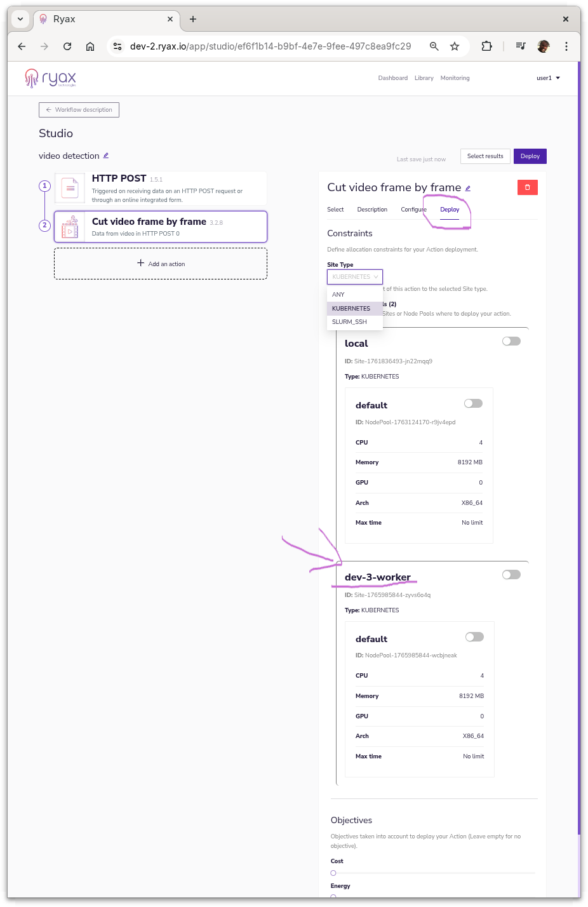

# Enable Multi-Site on Ryax

!!! warning
    This documentation assumes that you already have a working Ryax installation, with a public IP and a configured DNS. See [Ryax install doc](./install_ryax_kubernetes.md) for more details.


Ryax is able to use multiple computing infrastructure at once, even during the single run of a workflow.
To enable the multi-site mode you will need to install a Ryax Worker for each site.
Ryax Worker currently supports two type of sites `SLURM_SSH` and `KUBERNETES`.

This document explains how to install and configure Workers.

## SLURM_SSH Worker

### Requirements

Because the SLURM_SSH worker uses SSH to connect to the SLURM cluster, 
the simplest way to deploy an SLURM_SSH worker is on the Ryax main site.
So, the only things you'll need are:

- SLURM installed on the cluster
- SSH access to the cluster with credentials to run SLURM commands
- Pyhton3 available on the Slurm login node
- (Recommended) Singularity install on the cluster to run Ryax Actions containers

!!! note
    With the usage of `custom script` you can run commands directly on the cluster and avoid the usage of Singularity,
    but Action packaging will be completely bypassed.


### Configuration

!!! warning
    Be sure to install the workers on the same cluster and namespace that is running `ryax-runner`.

Ryax allows you to register one or more SLURM partitions to run your actions on. 
To do so, you need to define in the configuration partition name and node resources

Here is a simple example of configuration:
```yaml
config:
  site:
    name: HPCSite-1
    type: SLURM_SSH
    spec:
      partitions:
        - name: default
          cpu: 16
          memory: 24G
          gpu: 1
          time: 2H
      credentials:
        server: my.hpc-site.com
        username: ryax
```
Each field explained in details:
* **site.name**: the name of the site that identifies the site in Ryax
* **site.type**: the type of the site (can SLURM_SSH or KUBERNETES)
* **site.spec.partitions**: the partition definitions. **Ryax only supports partition with homogeneous node for now.** Each resource value is given by node.
  * **name**: name of the partition.
  * **cpu**: amount of allocatable cpu core per node.
  * **memory**: amount of allocatable memory in bytes per node.
* **site.credentials**: Contains credential to SSH to HPC cluster login server.

To extract the partition information we provide a helper script to run on the Slurm login node:
```shell
wget "https://gitlab.com/ryax-tech/ryax/ryax-runner/-/raw/master/slurm-ryax-config.py"
chmod +x ./slurm-ryax-config.py
./slurm-ryax-config.py > worker-hpc.yaml
```

Now you can edit the file to add your credentials for Ryax to be able to SSH to the HPC loin node:

```yaml
config:
  site:
    spec:
      # ...
      credentials:
        username: ryax
        server: hpc.example.com
```

!!! warning
    Names must be unique among worker on the main site.

The private key will be injected during the installation phase.

For more details about the Ryax Worker configuration please see the [Worker reference documentation](../reference/configuration.md#worker-configuration)

### Installation

Now you can install the Worker on the Ryax main site. To do so, we will use the configuration defined above.

Also, we will inject the SSH private key required to access the SSH cluster.
```sh
helm upgrade --install worker-hpc-1 \
  oci://registry.ryax.org/release-charts/worker  \
  --version 25.10.0-3 \
  --namespace ryaxns \
  --values worker-hpc.yaml \
  --set-file hpcPrivateKeyFile=./my-ssh-private-key
```

* `worker-hpc-1`: name of the helm release
* `worker-hpc.yaml`: file containing the configuration of the worker
* `my-ssh-private-key`: rsa private key file that has authorization to login

Once the worker is up and running, you should see a new site available in UI, in the workflow edition, in the *Deploy* tab of each action.
Now you just have to select the SLURM_SSH site in the *Deploy* configuration to tell Ryax to execute your Action there on the next run.

If you want more control on the way Slurm deploys your action (run parallel jobs), add the HPC addon to you action.
See the [HPC offloading](../reference/hpc.md) reference for more details.

## Kubernetes Worker

### Requirements

First, you'll need a Kubernetes cluster, of course! Be sure that your cluster is able to provision Persistent Volumes (most of the Kubernets clusters do, by default).
```sh
kubectl get storageclass
```


This command should show you at least one storage class with the *default* flag, if this is not the case you should install one.
Make sure that the storage class you want to use is set as default. You can set a storage class as default with:

```shell
kubectl patch storageclass YourStorageClassName -p '{"metadata": {"annotations":{"storageclass.kubernetes.io/is-default-class":"true"}}}'
```

Change `YourStorageClassName` accordingly. 
For a simple example you can use `local-path`, from the [Local Provisioner](https://github.com/rancher/local-path-provisioner) storage class
if available.

To install a Ryax Worker on Kubernetes we will use Helm.

Supported versions:

* Kubernetes > 1.19
* Helm > 3.x

Hardware Requirements:

* At least 2 CPU core
* 2GB of memory
* 1GB of disk available

**Note that resource requirements really depends on your usage of the cluster.**

### Configuration

In order to configure your Worker, you will need to select one or more node pools (set of homogeneous nodes) and give to the Worker some information about the nodes.

!!! info
    Why we use node pools? Because it allows Ryax to leverage the Kubernetes node **autoscaling with scale to zero !**

Here is a simple example of configuration for aws:

```yaml
config:
  site:
    name: aws-kubernetes-cluster-1
    spec:
      nodePools:
      - name: small
        cpu: 2
        memory: 4G
        selector:
          eks.amazonaws.com/nodegroup: default
```
let's exaplain each field:
* **site.name**: the name of the site that identifies the site in Ryax
* **site.spec.nodePools**: the node pools definitions (a node pool is a set of homogeneous node. Each resource value is given by node). 
  * **name**: name of the node pool.
  * **cpu**: amount of allocatable cpu core per node.
  * **memory**: amount of allocatable memory in bytes per node.


These fields might change depending on the cloud provider. Below an example of configuration for Azure.

```yaml
config:
  site:
    name: azure-kubernetes-cluster-2
    spec:
      nodePools:
      - name: small
        cpu: 2
        memory: 4G
        selector:
          kubernetes.azure.com/agentpool: default
```

All node pool information can be obtained using a simple:
```sh
kubectl describe nodes
```
To obtain resources values, look for the *Allocatable* fields.
Regarding the selector, you should find the label(s) that uniquely refers to your node pool (little hint: there is often *pool* in it ☺️).

For more details about the Worker configuration please see the [Worker reference documentation](../reference/configuration.md#worker-configuration)

Once your configuration is ready save it for later to a `worker.yaml` file.

### Preparing

For the worker to communicate securely to the main Ryax site, we need to create a secure connection access between the two Kuberenetes clusters.
In this How-To we will use [Skupper](https://skupper.io), but other multi-cluster network technology might work. 
Make sure you have kubectl access to both clusters, we are going to reference as **main-site** the kubernetes that has all Ryax services including the UI and **worker-site** the kubernetes cluster that we will attach to run Ryax's actions.

* Install skupper v2 cli, in your local machine

```shell
curl https://skupper.io/v2/install.sh | sh
```

**main-site & worker-site**
* Remove skupper v1 in both sites if installed, if not you can skip this step
```shell
kubectl delete -n ryaxns deployment.apps/skupper-router deployment.apps/skupper-service-controller service/skupper-router service/skupper-router-local
```

**main-site & worker-site**
* Install skupper v2 custom resources definition CRDs, in both sites
```shell
helm install skupper oci://quay.io/skupper/helm/skupper --version 2.1.3
```

**worker-site**
* Create namespaces `ryaxns` and `ryaxns-execs` required by Ryax on the **worker-site**.
```yaml
kubectl create namespace ryaxns
kubectl create namespace ryaxns-execs
```


### Configure skupper

To resume we need the **worker-site** to access **main-site** services. More precisely, we need to expose the following services:
- *registry*: to pull action images
- *filestore*: to read and write files (actions static parameters, execution I/O)
- *broker*: to communicate with other Ryax services

The registry is already exposed on the internet so only the secrets are required to access it. For filestore and broker, however, we need to provide a mechanism to reach out from the **worker-site**. For that, we are going to install skupper in both sites and configure it accordingly to the procedure below. Note that a **worker-site** means the command should run on the **worker-site** only, likewise the **main-site** marks when a command must run ONLY on the **main-site**. All `skupper` cli commands will use the default kubectl configuration, so be careful to set you KUBECONFIG environment variable accordingly.


**worker-site**
* On the **worker-site**, first create the skupper site, it is very important to enable link-access so it can have the services of the main site exposed later.
```shell
skupper -n ryaxns site create worker-site --enable-link-access
```

**main-site**
* Second, create the skupper site resource.
```shell
skupper -n ryaxns site create main-site
```

**worker-site**
* Now create the token to redeem on the main site, keep secret.token in a secure location it will work for the first attempt to connect and then be useless.
```shell
skupper -n ryaxns token issue ../secret.token
```

**main-site**
* Redeem the created token to allow connection with the worker.
```shell
skupper -n ryaxns token redeem ../secret.token
```

**worker-site**
* The worker site must create a listener to have the main-site broker (ryax-broker-ext) and filestore (minio-ext) services exposed on its side.
```shell
skupper -n ryaxns listener create ryax-broker-ext 5672
skupper -n ryaxns listener create minio-ext 9000
```

**main-site**
* The main-site must create a connector to allow the listeners to reach its local services, note that we use `--workload` to specify the target service of the connector.
```shell
skupper -n ryaxns connector create ryax-broker-ext 5672 --workload service/ryax-broker
skupper -n ryaxns connector create minio-ext 9000 --workload service/minio
```

**main-site**
* Save the secrets to access Ryax services, the secrets include sensitive information please keep this file safe and delete it as after the next step. We provide a small helper script to inject the "-ext" suffix needed for remote services mapping.
```shell
wget "https://gitlab.com/ryax-tech/ryax/ryax-runner/-/raw/master/k8s-ryax-config.py"
chmod +x ./k8s-ryax-config.py
./k8s-ryax-config.py
```

**worker site**
* Install saved secrets from previous step on the **worker-site** (after this command it is safe to delete the secrets file):
```shell
kubectl apply -f ./secrets
```

**worker site**
* Now that we have the configuration and a secure connection with the credentials we will use Helm to install the latest Ryax Worker:
```sh
helm upgrade --install ryax-worker oci://registry.ryax.org/release-charts/worker --version 25.10.0-3 --values worker.yaml -n ryaxns
```

---

That's it! Once the worker is up and running, you should see a new site available in UI, while editing the workflow in the *Deploy* tab for each action (might need to refresh if the workflow was already open on edit mode).



### Trouble Shooting

#### Container pending on persistent volume claim.

Check if the pvc was created with the correct storage class.

```shell
kubectl get storageclass
kubectl get pvc -n ryaxns
```

The PVC status should be `BOUND`, if they are not it is probably because the cloud provider require
some extra configuration to create. In our tests, with AWS it was necessary
to associate an EBS addon.

Create iam service account with the role for EBS driver.

```shell
eksctl create iamserviceaccount \
  --region eu-west-3 \
  --name ebs-csi-controller-sa \
  --namespace kube-system \
  --cluster multi-site-pre-release-test \
  --attach-policy-arn arn:aws:iam::aws:policy/service-role/AmazonEBSCSIDriverPolicy \
  --approve \
  --role-only \
  --role-name AmazonEKS_EBS_CSI_DriverRole
```

Then you have to create the addon associating with the account.

```shell
eksctl create addon \
 --name aws-ebs-csi-driver \
 --cluster multi-site-pre-release-test \
 --service-account-role-arn arn:aws:iam::$(aws sts get-caller-identity --query Account --output text):role/AmazonEKS_EBS_CSI_DriverRole --force
```

Now make the storage class the default.

```shell
kubectl patch storageclass gp2 -p '{"metadata": {"annotations":{"storageclass.kubernetes.io/is-default-class":"true"}}}'
```

[StackOverflow discussion](https://stackoverflow.com/questions/75758115/persistentvolumeclaim-is-stuck-waiting-for-a-volume-to-be-created-either-by-ex)

#### Troubleshot: Certificate Is Not Valid

For Ryax to have a valid TLS certificate, you need to have a DNS entry that point to you cluster. Please, check the
section related to this process in the [installation documentation](install_ryax_kubernetes.md#configure-the-dns).

You can check the state of the certificate request using:
```shell
kubectl get certificaterequests -A
kubectl get orders.acme.cert-manager.io -A
```
