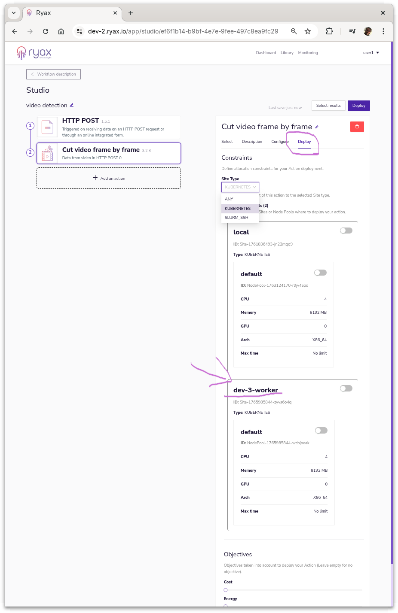

# Enable Multi-Site on Ryax

!!! warning
    This documentation assumes that you already have a working Ryax installation, with a public IP and a configured DNS. See [Ryax install doc](./install_ryax_kubernetes.md) for more details.


Ryax is able to use multiple computing infrastructure at once, even during the single run of a workflow.
To enable the multi-site mode you will need to install a Ryax Worker for each site.
Ryax Worker currently supports two type of sites `SLURM_SSH` and `KUBERNETES`.

This document explains how to install and configure Workers.

## SLURM_SSH Worker

### Requirements

Because the SLURM_SSH worker uses SSH to connect to the SLURM cluster, 
the simplest way to deploy an SLURM_SSH worker is on the Ryax main site.
So, the only things you'll need are:

- SLURM installed on the cluster
- SSH access to the cluster with credentials to run SLURM commands
- Pyhton3 available on the Slurm login node
- (Recommended) Singularity install on the cluster to run Ryax Actions containers

!!! note
    With the usage of `custom script` you can run commands directly on the cluster and avoid the usage of Singularity,
    but Action packaging will be completely bypassed.


### Configuration

!!! warning
    Be sure to install the workers on the same cluster and namespace that is running `ryax-runner`.

Ryax allows you to register one or more SLURM partitions to run your actions on. 
To do so, you need to define a *Site* and one or more partitions, called *Node Pools* in Ryax, in the infrastructure view of the Ryax UI.

Now that your Site and you Node Pools are created, their IDs are required to create the Worker configuration.
Create a worker-values.yaml file and copy the Site and Node Pools IDs from the Ryax UI to add them to the configuration
like in the following example: 

```yaml
config:
  site:
    id: Site-1777021590-tq6kqbbe
    type: SLURM_SSH
    spec:
      partitions:
        - name: default # name of the partition as define in Slurm
          id: NodePool-1777021590-n3y8xs0g
      credentials:
        server: my.hpc-site.com
        username: ryax
loki:
  enabled: false
intelliscale:
  enabled: false
```
Each field explained in details:

- **site.id**: the name of the site that identifies the site in Ryax
- **site.type**: the type of the site (can SLURM_SSH or KUBERNETES)
- **site.spec.partitions**: the partition definitions. **Ryax only supports partition with homogeneous node for now.** Each resource value is given by node.
  - **name**: name of the partition in Slurm (Will be use to target the partition).
  - **id**: id of the partition provided by the Ryax UI.
- **site.spec.credentials**: Contains credential to SSH to HPC cluster login server. The private key will be injected during the installation phase.

For more details about the Ryax Worker configuration please see the [Worker reference documentation](../reference/configuration.md#worker-configuration)

### Installation

Now you can install the Worker on the Ryax main site. To do so, we will use the configuration defined above.

Also, we will inject the SSH private key required to access the SSH cluster.
```sh
helm upgrade --install ryax-worker-hpc \
  oci://registry.ryax.org/release-charts/ryax-worker  \
  --version 26.4.0 \
  --namespace ryaxns \
  --values worker-values.yaml \
  --set-file hpcPrivateKeyFile=./my-ssh-private-key
```

* `ryax-worker-hpc`: name of the helm release
* `worker-values.yaml`: file containing the configuration of the worker
* `my-ssh-private-key`: rsa private key file that has authorization to login

Once the worker is up and running, you should see a new site available in UI, in the workflow edition, in the *Deploy* tab of each action.
Now you just have to select the SLURM_SSH site in the *Deploy* configuration to tell Ryax to execute your Action there on the next run.

If you want more control on the way Slurm deploys your action (run parallel jobs), add the HPC addon to you action.
See the [HPC offloading](../reference/hpc.md) reference for more details.

## Kubernetes Worker

### Requirements

First, you'll need a Kubernetes cluster, of course! Be sure that your cluster is able to provision Persistent Volumes (most of the Kubernets clusters do, by default).
```sh
kubectl get storageclass
```

This command should show you at least one storage class with the *default* flag, if this is not the case you should install one.
Make sure that the storage class you want to use is set as default. You can set a storage class as default with:

```shell
kubectl patch storageclass YourStorageClassName -p '{"metadata": {"annotations":{"storageclass.kubernetes.io/is-default-class":"true"}}}'
```

Change `YourStorageClassName` accordingly. 
For a simple example you can use `local-path`, from the [Local Provisioner](https://github.com/rancher/local-path-provisioner) storage class
if available.

To install a Ryax Worker on Kubernetes we will use Helm.

Supported versions:

* Kubernetes > 1.30
* Helm > 3.x

Hardware Requirements:

* At least 2 CPU core
* 2GB of memory
* 1GB of disk available

**Note that resource requirements really depends on your usage of the cluster.**

### Configuration

<!-- TODO: This is the exact copy of the install worker configuration part -->
<!-- reformat or use include-markdown https://pypi.org/project/mkdocs-include-markdown-plugin/ -->

In order to configure your Worker, you will need to register a *Site* and or more *Node Pools* (set of homogeneous nodes) in the Ryax UI.
To do so, go into the Infrastructure view of your Ryax installation (For example in https://ryax.example.com/app/infrastructure) and create a new Site.
Then create a new Node pool that match the characteristics of the computing node (servers) that you want to attach to Ryax.

Now that your Site and you Node Pools are created, we will need to their IDs to create the Worker configuration.
Create a `worker-values.yaml` file and copy the Site and Node Pools IDs from the Ryax UI to add them to the configuration like in the following example.  

Here is a simple example worker configuration using an AWS EKS managed cluster:

```yaml
config:
  site:
    id: Site-1777021590-tq6kqbbe
    spec:
      nodePools:
      - id: NodePool-1777021590-n3y8xs0g
        selector:
          eks.amazonaws.com/nodegroup: default
```

Let's explain each field of the `config`:

- **site.id**: the id of the site copied from the Ryax UI.
- **site.spec.nodePools**: the node pools definitions (a node pool is a set of homogeneous node. Each resource value is given by node).
  - **id**: the id of the node pool copied from the Ryax UI.
  - **selector**: node selector that precises within Kubernetes which nodes will take part in the node pool.


These fields might change depending on the cloud provider. Below an example of configuration for Azure.

```yaml
kubernetes.azure.com/agentpool: default
```

All node pool information can be obtained using a simple:
```sh
kubectl describe nodes
```

To obtain resources values, look for the *Allocatable* fields.
Regarding the selector, you should find the label(s) that uniquely refers to your node pool.

For more details about the Worker configuration please see the [Worker reference documentation](../reference/configuration.md#worker-configuration).

To be able to scale to 0 when unused, your node pools must be dedicated to the Ryax users workload.
For the node pool to be used only by Ryax actions, we advise you to put a taint on your nodes using the `ryax.tech/ryaxns-execs` key.
Because all the Ryax action already have a toleration for this by default, they will be the only pods that will be allowed to deployed there.

Adding a taint on a node pool depends on your provider but here an example configuration:

```yaml
taints:
 - effect: NO_SCHEDULE
   key: ryax.tech/ryaxns-execs
   value: only
```

### GPU node pools with MIG

For GPU node pools, Ryax IntelliScale recommends a [Multi-Instance GPU (MIG)](https://docs.nvidia.com/datacenter/tesla/mig-user-guide/)
profile per action so that several actions can share one physical GPU. Ryax does
**not** partition the GPUs itself: the cluster administrator must pre-partition
the GPU nodes into MIG instances. This is a one-time setup per GPU node pool.

The standard way to do this on Kubernetes is the
[NVIDIA GPU Operator](https://docs.nvidia.com/datacenter/cloud-native/gpu-operator/latest/index.html)
with its [MIG Manager](https://docs.nvidia.com/datacenter/cloud-native/gpu-operator/latest/gpu-operator-mig.html),
which reads the `nvidia.com/mig.config` node label and applies the matching MIG
geometry to the GPUs on that node.

Keep each GPU node pool **homogeneous** (one MIG profile per pool) and label its
nodes with the MIG profile you want, prefixing it with `all-` to apply it to
every GPU on the node:

```sh
# Example: split every GPU on the node into 1g.10gb MIG instances
kubectl label node <node-name> nvidia.com/mig.config=all-1g.10gb --overwrite
```

Apply the same label to every node in the pool (for example through your cloud
provider's node-pool labels so new nodes are labeled automatically on scale-up).

The MIG profile you choose must be one of the profiles Ryax is configured to
support (`.Values.config.MIG.supportedInstances`, e.g. `1g.10gb,3g.40gb,7g.80gb`)
so that IntelliScale only recommends instances your nodes can actually provide.

!!! note
    Earlier Ryax versions shipped a node-labeler DaemonSet that derived the MIG
    config from a `gpu-pool-mig-*` node label. That component has been removed;
    label your GPU nodes with `nvidia.com/mig.config` directly as shown above.

### Preparing

For the worker to communicate securely to the main Ryax site, we need to create a secure connection access between the two Kuberenetes clusters.
In this How-To we will use [Skupper](https://skupper.io), but other multi-cluster network technology might work. 
Make sure you have kubectl access to both clusters, we are going to reference as **main** the kubernetes that has all Ryax services including the UI and **worker** the kubernetes cluster that we will attach to run Ryax's actions.

**local machine**
  
* Install skupper v2 cli, in your local machine:
  ```shell
  curl https://skupper.io/v2/install.sh | sh
  ```

**main & worker**
  
* Remove skupper v1 in both sites if installed, if not you can skip this step:
  ```shell
  kubectl delete -n ryaxns deployment.apps/skupper-router deployment.apps/skupper-service-controller service/skupper-router service/skupper-router-local
  ```

**main & worker**
  
* Install skupper v2 custom resources definition CRDs and controller, in both sites:
  ```shell
  helm install skupper oci://quay.io/skupper/helm/skupper --version 2.1.3
  ```

**main**

* Disable the Skupper grant server on the main site. It is not needed with this setup (we do not use token grants) and it would otherwise create a `LoadBalancer` service that allocates an extra public IP. We also clean up the grant server resources the controller may have already auto-created (wait for the rollout to finish first, otherwise the old controller pod recreates them):
  ```shell
  kubectl -n default patch deployment skupper-controller --type json \
    -p '[{"op":"replace","path":"/spec/template/spec/containers/0/args","value":[]}]'
  kubectl -n default rollout status deployment skupper-controller
  kubectl -n default delete securedaccess skupper-grant-server --ignore-not-found
  kubectl -n default delete certificates.skupper.io skupper-grant-server skupper-grant-server-ca --ignore-not-found
  kubectl -n default delete service skupper-grant-server --ignore-not-found
  ```

!!! note
    The commands above assume the skupper helm chart was installed in the `default` namespace, adapt the `-n` flag if you installed it elsewhere.

**worker**
 
* Create namespaces `ryaxns` and `ryaxns-execs` required by Ryax on the worker:
  ```yaml
  kubectl create namespace ryaxns
  kubectl create namespace ryaxns-execs
  ```


### Why do I need skupper?

To resume we need the **worker** to access **main** services. More precisely, we need to expose the following services:

- *registry*: to pull action images
- *filestore*: to read and write files (actions static parameters, execution I/O)
- *broker*: to communicate with other Ryax services

The registry is already exposed through the traefik ingress, only the secrets are required to access it. For filestore and broker, however, we need to provide a mechanism to reach out from the **worker**. For that, we are going to install skupper in both sites and configure it accordingly to the procedure below. Note that a **worker** means the command should run on the **worker** only, likewise the **main** marks when a command must run ONLY on the **main**. All `skupper` cli commands will use the default kubectl configuration, so be careful to set you KUBECONFIG environment variable accordingly.

The **main** site is the one that accepts incoming Skupper links: the **worker** connects out to it, which also works when the worker runs on a private network (on-premises, behind NAT).
Instead of letting Skupper expose its router with a dedicated `LoadBalancer` service (which would allocate an extra public IP), we reuse the Traefik ingress already installed by Ryax on the **main** site and route the Skupper traffic by TLS SNI passthrough.
For this you need a DNS entry, for example `skupper.ryax.example.com`, pointing to the same public IP as your Ryax installation (the `ryax-traefik` LoadBalancer). In the commands below, replace `skupper.ryax.example.com` with your own DNS name.

**main**

* First create the skupper site on the **main** site. We intentionally do **not** use `--enable-link-access` here: that flag would expose the router through a `LoadBalancer` service. Link access is configured manually through Traefik in the next steps.
  ```shell
  skupper -n ryaxns site create main
  ```

**main**

* Configure the router access. The `accessType: local` only creates a cluster-internal service, no public IP. Because Skupper on Kubernetes cannot add extra DNS names to the certificate it generates, we disable the certificate generation (`generateTlsCredentials: false`) and define the server certificate ourselves, including the public DNS name in `hosts`. Save the following as `skupper-router-access.yaml` and apply it with `kubectl apply -f skupper-router-access.yaml`:
  ```yaml
  apiVersion: skupper.io/v2alpha1
  kind: RouterAccess
  metadata:
    name: skupper-router
    namespace: ryaxns
  spec:
    accessType: local
    generateTlsCredentials: false
    tlsCredentials: skupper-site-server
    roles:
    - name: inter-router
      port: 55671
    - name: edge
      port: 45671
  ---
  apiVersion: skupper.io/v2alpha1
  kind: Certificate
  metadata:
    name: skupper-site-server
    namespace: ryaxns
  spec:
    ca: skupper-site-ca
    subject: skupper-router
    server: true
    hosts:
    - skupper-router
    - skupper-router.ryaxns
    - skupper.ryax.example.com
  ```

**main**

* Expose the skupper router through Traefik with TLS passthrough. Skupper uses mutual TLS between routers, so Traefik must not terminate the connection: it only routes it based on the SNI hostname. Save as `skupper-ingressroute.yaml` and apply with `kubectl apply -f skupper-ingressroute.yaml`:
  ```yaml
  apiVersion: traefik.io/v1alpha1
  kind: IngressRouteTCP
  metadata:
    name: skupper-router
    namespace: ryaxns
  spec:
    entryPoints:
    - websecure
    routes:
    - match: HostSNI(`skupper.ryax.example.com`)
      services:
      - name: skupper-router
        port: 55671
    tls:
      passthrough: true
  ```

* You can now check that the site is ready:
  ```shell
  skupper -n ryaxns site status
  ```

**worker**

* Create the skupper site on the **worker**. No link access is needed on this side, the worker only initiates the connection:
  ```shell
  skupper -n ryaxns site create worker
  ```

**main**

* Generate the link definition that the worker will use to connect to the main site:
  ```shell
  skupper -n ryaxns link generate > link-to-main.yaml
  ```
  Since Skupper is not aware of the Traefik exposure, edit `link-to-main.yaml` and replace `spec.endpoints` of the `Link` resource so that the `inter-router` endpoint points to the DNS name on port `443` (the `edge` endpoint can be removed, it is not used for site-to-site links):
  ```yaml
  spec:
    endpoints:
    - name: inter-router
      host: skupper.ryax.example.com
      port: "443"
  ```
  The file also contains a `Secret` with the TLS credentials of the link, keep it in a secure location and delete it after the next step.

**worker**

* Apply the link on the **worker** and check that it becomes ready (`Ready` status may take a few seconds):
  ```shell
  kubectl -n ryaxns apply -f link-to-main.yaml
  skupper -n ryaxns link status
  ```

**main**

* The main site must create a connector to allow the listeners to reach its local services, note that we use `--workload` to specify the target service of the connector.
  ```shell
  skupper -n ryaxns connector create ryax-broker-ext 5672 --workload service/ryax-broker
  skupper -n ryaxns connector create ryax-minio-ext 9000 --workload service/ryax-minio
  ```

**worker**

* The worker must create a listener to have the main site broker (ryax-broker-ext) and filestore (ryax-minio-ext) services exposed on its side.
  ```shell
  skupper -n ryaxns listener create ryax-broker-ext 5672
  skupper -n ryaxns listener create ryax-minio-ext 9000
  ```

**worker**

* Wait until the connector status is ok.
  ```shell
  skupper listener status -n ryaxns
  ```

* Expected output
  ```shell
  NAME            STATUS  ROUTING-KEY     HOST            PORT   MATCHING-CONNECTOR   MESSAGE
  ryax-broker-ext Ready   ryax-broker-ext ryax-broker-ext 5672   true                 OK
  ryax-minio-ext  Ready   ryax-minio-ext  ryax-minio-ext  9000   true                 OK
  ```

**main**

* Save the secrets to access Ryax services, the secrets include sensitive information please keep this file safe and delete it as after the next step. We provide a small helper script to inject the "-ext" suffix needed for remote services mapping.
  ```shell
  wget "https://gitlab.com/ryax-tech/ryax/ryax-runner/-/raw/master/k8s-ryax-config.py"
  chmod +x ./k8s-ryax-config.py
  ./k8s-ryax-config.py
  ```

**worker**

* Install saved secrets from previous step on the **worker** (after this command it is safe to delete the secrets file):
  ```shell
  kubectl apply -f ./secrets
  ```

**worker**

* Now that we have the configuration and a secure connection with the credentials we will use Helm to install the latest Ryax Worker:
  ```sh
  helm upgrade --install ryax oci://registry.ryax.org/release-charts/ryax-worker --version 26.4.0 --values worker-values.yaml -n ryaxns
  ```
* For help `worker-values.yaml` see the guide [here](#configuration-1).

That's it! Once the *ryax-worker* pod is up and running, you can test it by forcing to deploy on that worker on the deploy tab.



### Trouble Shooting

#### Container pending on persistent volume claim.

Check if the pvc was created with the correct storage class.

```shell
kubectl get storageclass
kubectl get pvc -n ryaxns
```

The PVC status should be `BOUND`, if they are not it is probably because the cloud provider require
some extra configuration to create. In our tests, with AWS it was necessary
to associate an EBS addon.

Create iam service account with the role for EBS driver.

```shell
eksctl create iamserviceaccount \
  --region eu-west-3 \
  --name ebs-csi-controller-sa \
  --namespace kube-system \
  --cluster multi-site-pre-release-test \
  --attach-policy-arn arn:aws:iam::aws:policy/service-role/AmazonEBSCSIDriverPolicy \
  --approve \
  --role-only \
  --role-name AmazonEKS_EBS_CSI_DriverRole
```

Then you have to create the addon associating with the account.

```shell
eksctl create addon \
 --name aws-ebs-csi-driver \
 --cluster multi-site-pre-release-test \
 --service-account-role-arn arn:aws:iam::$(aws sts get-caller-identity --query Account --output text):role/AmazonEKS_EBS_CSI_DriverRole --force
```

Now make the storage class the default.

```shell
kubectl patch storageclass gp2 -p '{"metadata": {"annotations":{"storageclass.kubernetes.io/is-default-class":"true"}}}'
```

[StackOverflow discussion](https://stackoverflow.com/questions/75758115/persistentvolumeclaim-is-stuck-waiting-for-a-volume-to-be-created-either-by-ex)

#### Troubleshot: Certificate Is Not Valid

For Ryax to have a valid TLS certificate, you need to have a DNS entry that point to you cluster. Please, check the
section related to this process in the [installation documentation](install_ryax_kubernetes.md#configure-the-dns).

You can check the state of the certificate request using:
```shell
kubectl get certificaterequests -A
kubectl get orders.acme.cert-manager.io -A
```
