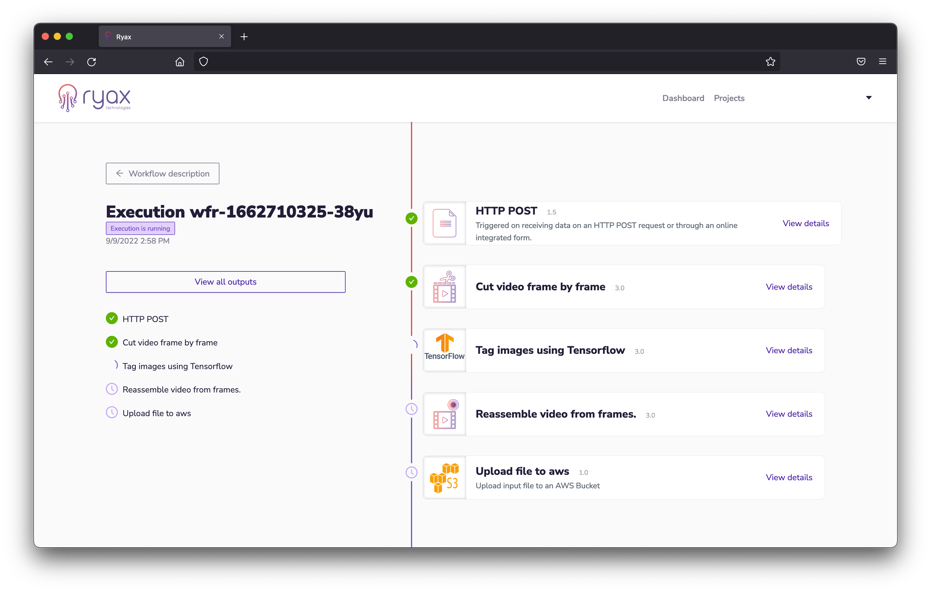

# Welcom to the Ryax Documentation

**Ryax is an multi-infrastructure open-source platform that enables the design, deployment, and
monitoring of your data analytics, Cloud automations and GenAI applications.**

Ryax makes the creation and execution of GenAI and data analytics apps
more accessible to all types of developers. It enables users to execute
their GenAI and data analytics applications across the Edge/Cloud/HPC
continuum seamlessly. It provides smart scheduling capabilities while
abstracting the complexity of managing applications in production.

This is the best place to start with Ryax. In the following sections we
cover what Ryax is, what problems it can solve, and how it compares to
existing software.

Need a quick crash course? Jump right in our [Quick Start
Guide](./tutorials/quick_start_guide.md)

## Overview

