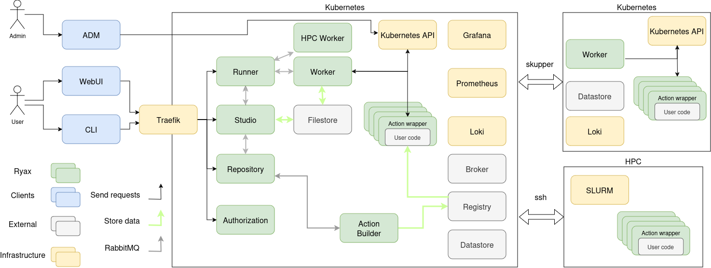
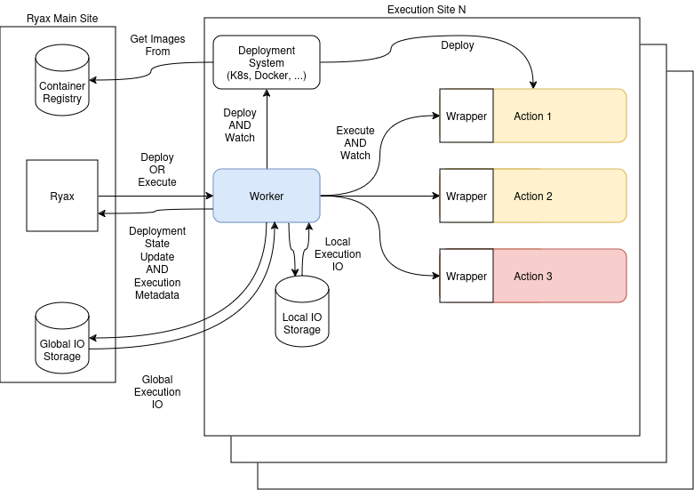

# Internal architecture

The internal architecture of Ryax platform is split into 3 main parts: The Ryax micro-services, the external services, and the infrastructure. The following figure provides a graphical view of the different components. Most of them are managed by the Kubernetes orchestrator to guarantee interoperability, flexibility, auto-healing, easy upgrade/downgrade and fault-tolerance of the deployed components’ microservices.

## Overview


<!-- https://show.zoho.com/show/open/hdu0w0a5f99ed72674995a5eeb61a213db4f9 -->


*The architecture design is done in a way so that our code can evolve quickly while keeping good quality.*

Micro-services are designed to manage one functional scope only. They do not share common libraries and avoid coupling to other micro-services as much as possible. They are following the Domain-Driven Design principles and more especially the guidelines provided by the [Architechture Patterns with Python Book](https://www.cosmicpython.com/book/preface.html).

They communicate through the broker with each others using a specific message for each interaction (no reuse of data structure to avoid coupling). The definition of messages is defined in the Protobuf format. The definition of these messages is owned by the service that **produces** this message.  Because those services are not sharing code if the inter-services message definition changes it has to be **copied from the owner code base to the consumers**.

Each service's data share nothing with other services. Thus, if the data schema evolves, the service manages its data migration (or retro compatibility) itself. 

## Interfaces of micro-services

### HTTP API

Most of these APIs are accessible by users and documented with OpenAPI.
We try to limit the use of these APIs between microservices as it creates a dependency.

### gRPC

HTTP suffers from multiple limitations (no heartbeats, uni-directional communication, limit in size, limit in response time).
Thus, we use gRPC instead between the Workers and the actions.

### RabbitMQ+protobuf

It is used for asynchronous events.

To manage these protocols more easily we use this set of rules:

- Emitters are responsible for the definition of the Protobuf.
- Emitters define up to the exchange (included).
- Consumers define from the exchange (included) to their queue.

Thus, we need a way to define and share easily RMQ exchanges (and their parameters) from one microservice to another. For now, the microservice that publishes the message is responsible for the `.proto` definition. These files are copied directly into the code base of the receiving microservice.


## Ryax Code: Our Microservices

### A Common Architecture

These micro-services are internally divided into layers.
The Domain layer defines business objects; ie. objects that also exist for users of the application ("PostgreSQL" is not such an object, however a "database" might, or a "candy" in an app about candies).
The Application layer holds the brain of the App. As for animals, the brain can think using abstractions (objects of our Domain layer) but cannot concretely do things by itself.
Finally, the Infrastructure layer is the "arms and legs" of our App. It is the part that interacts with the external world (the HTTP API, the database, the filesystem, the servomotors, ...).

#### Domain
The Domain layer represents the model of the services. This is the core of the services and must be able to evolve faster. This layer depends on no other layer (following the dependency inversion principle) and imports no external libraries: unless justified exceptions, it is only raw python code.

A domain is a dataclass defining a business object.
Most of the methods of these dataclasses are helpers to manipulate the dataclass state.

Some of these classes are abstract classes that will be implemented by classes that are in the infrastructure layer.

Methods of these classes can return Domain objects, states ("something went wrong", "no problem here", "only steps 1 and 3 worked"...), or nothing.

The general rule is to put as much stuff possible there.

#### Application
The Application layer contains all the services provided by the application using the Domain structures and the Infrastructure as a backend.

These Application services "orchestrate" the Domain structures and the Infrastructure services so that they work together.

Application data should not be modified here; it is the job of the methods of the classes of the Domain layer. Thus, you might find this kind of code in a domain class:

```python
from myapp.domain.a_domain_object import ADomainObject

..

class SuperService:
	..
  def update_me(self, object_id, new_data):
  	object: ADomainObject = self.unit_of_work.get_object(object_id)
    try:
	    object.update_this(new_data)
    except ..

```
As mentioned before, no data is directly modified here. However, we catch exceptions and use object methods to apply the right business rules.


#### Infratructure

Manage all the interactions with external systems like databases, file systems, networks, APIs, etc.

These services act as "wrappers" around external dependencies so that they can be used within the Domain layer.
These wrappers should not return data (as it would mean that some data will be managed in the domain, which is forbidden).
Most of the time they return nothing, or they return how well the command performs. For example, "something went wrong", "no problem here", "only steps 1 and 3 worked"...


### The Micro-Services

This section contains the list of all Ryax services. 

!!! note
    If a action is *accessible by users*, the accessible endpoints require to be protected using the `authentification` microservice.


#### Authorization

This service manages the users, the projects, and the authorization associated with them. It is a critical part of the infrastructure because it is called by other services for each user HTTP request to verify the authorization of the current user for the current project.

It is also used for login and user and project management so it exposes an HTTP API to the user.

It uses the Postgres datastore to persist its state using an ORM.


**Description:**
Manage user authorization and projects in Ryax. It is called by all other user-facing services to get the current project and user authorization in this project. 

**Responsibilities**:

- Authentification
- User management (through projects)

**Accessible by users**: Yes

#### Runner

The Runner service is the core of the Ryax tool because it is the execution engine for the user's workflows. It gets workflow deployment and undeployment orders from the Studio. It also provides feedback and history on the workflow runs through 
an HTTP API.

It uses the Postgres datastore to persist its state using an ORM.


**Description:**
Make the interface between Ryax and the computing resources to launch actions and run workflows. Thus, it does the deploying, running, and scheduling of workflows.
It also manages the execution metadata and data.


https://gitlab.com/ryax-tech/dev/backend/runner

This micro-service speaks gRPC (with the actions), RMQ with Studio, and HTTP for standalone usage.

**Responsibilities**:

- Deployment 
	- Communicate with the worker to get computing resources
	- Deploy/undeploy actions
- Manage the workflow execution:
  - Get new execution triggers
  - Fetch/push execution data from/to the filestore (Minio)
  - Push data to actions so that they create executions
- Scheduling
  - Communicate with the worker to scale the infrastructure
  - Scale actions
  - Trigger executions (if necessary)
  - Store waiting executions, and has an algorithm to decide which execution to start first
- Archiving
  - Holds and manages execution metadata
  - Keep track of all executions and expose an API for querying execution metadata
  - Keep track of the workflow deployment states

**Accessible by users**: Yes

#### Worker

The worker entity called the Worker make the link between Ryax and the local sites.

The worker register itself in Ryax using a gRPC interface.
**Responsibilities**:

- Get access to computing resources 
- Receive execution trigger
- Deploy the action if not already done (might be done beforehand depending on the deployment policy)
- Fetch execution data from remote filestore
- Activate the action with its inputs and grab the outputs
- Push execution data to local/remote storage
- Send results and their metadata to Ryax
- Undeploy the action (might be done beforehand depending on the deployment policy)
- Trigger the next execution (go back to step 2)
- Deployment scaling, depending on the underlying infra it can have different policies. For example, it can only allocate resource when a new execution is coming or keep all actions always deploy for performance reasons.



Regarding  executions, the Worker gets IO from global when an action is triggered from an external action (action from another site) and push OI to local storage. 
The Worker is in charge of pushing the data to the global storage if an execution is not in its site. 
Since the I/O files is distributed over multiple sites, we need a way to share data between sites.
To do so, we introduce a new public facing storage. In our case we make use of our fileStore (minio) that we expose publicly, but it could also be any Cloud storage. 
Based on this the data can be shared between site using this public storage with the following policy:

*Outputs:*

- always push I/O files in local storage.
- if one of the next execution is in the another site also push data to the global storage. This is done by the Worker.

*Inputs:*

- if an I/O file comes from an execution done on another site pull I/O files from global storage
- otherwise pull I/O files from the local storage

#### Repository

**Description:**
The Repository service allows the Ryax users to scan Git repositories and import Ryax actions. It also permits to trigger actions build through the Action Builder. Once the build is finished, the actions are sent to the Studio to be placed in the action Store.

It exposes an HTTP Rest API that is used by the WebUI and the CLI. 

It uses the Postgres datastore to persist its state using an ORM.

**Responsibilities**:

- Manage repositories
- Command the action builder to build new actions
- Detect some action errors

**Accessible by users**: Yes


#### Studio

The Studio service permits Ryax users to create, update and deploy workflows. 

It exposes an HTTP Rest API that is used by the WebUI and the CLI. 

It uses the Postgres datastore to persist its state using an ORM.


**Description:**
The Studio service permits Ryax users to create and deploy workflows.

**Responsibilities**:

- Create and edit workflows

**Accessible by users**: Yes


#### Action Builder

**Description:**
This service is stateless. It only receives action build orders from the Repository service and then does the build sequentially and synchronously (one at a time).

It depends on the action wrapper to build actions.

**Responsibilities**:

- Build actions and push them to the registry

**Accessible by users**: No


#### WebUI


**Description:**
An NGINX server that serves our frontend written with Angular.

Angular is based on the CQRS (Command Query Responsibility Segregation) with reactive programming. The application is split into DDD bounded contexts (BC). BC contains Domains that include business logic, Components for UI, Features, and shells. Shells are entry points to the BC: It maps features to HTTP endpoints.


## External services

They are used as infrastructure for message passing and storage.


### Datastore (PostgreSQL)

**Description:**
It is a PostgreSQL database that stores the state of all stateful services. Each service has a different access credential and a separate database.

**Responsibilities**:

- Store micro-services states

**Accessible by users**: No


### Filestore (Minio)

**Description:**
It is a Minio file storage service that exposes an S3-compatible API. It stores execution I/O files and directories. 

**Responsibilities**:

- Store and serve execution IO

**Accessible by users**: No


### Broker (RabbitMQ)

**Description:**
This is a RabbitMQ message broker. It enables internal communication between all services using messages serialized in Protobuf.

**Responsibilities**:

**Accessible by users**: No


### Registry (docker registry)

**Description:**
A container registry where the users' actions are stored. It is populated by the action builder and the images are pulled from Kubernetes at deployment time.

**Responsibilities**:

- Store and serve containers of actions

**Accessible by users**: No


### Kubernetes

**Description:**

**Responsibilities**:

- Run all Ryax services (except external Workers and HPC Actions)
- Abstract underlying infrastructure

**Accessible by users**: No


## Tools and other

### Action wrapper


**Description:**
A small bit of code between our system and the user code to be able to run it.

This is not an internal Ryax service but a wrapper that is put around user code to communicate with Ryax. It creates a gRPC server with a simple interface that initializes the action and then runs executions.
This wrapper works for both processors and source actions with the same protocol: the source actions are streaming execution responses, while the processors are only sending one response and closing the connection.

It also contains the Action builder code in Nix.

**Responsibilities**:

- Build Ryax actions
- Run user code when asked to
- Prepare data to be able to run user code
- Get the resulting data and push it back
- Clean the system so that it can start a new computation without old data being around

**Accessible by users**: Not through an API, but the user code is tightly coupled to this.


## Infrastructure

Our infrastructure is based on Kubernetes and every service is deployed with it.

Our monitoring stack is based on Prometheus for metrics, Loki for the logs aggregation, and Grafana for querying data and visualization. 

The Ingress Network is managed by Traefik which routes the requests depending on the path prefix, e.g.  **/runner** goes to the Runner service 

We also use Cert-Manager for automatic Let's encrypt certificates
