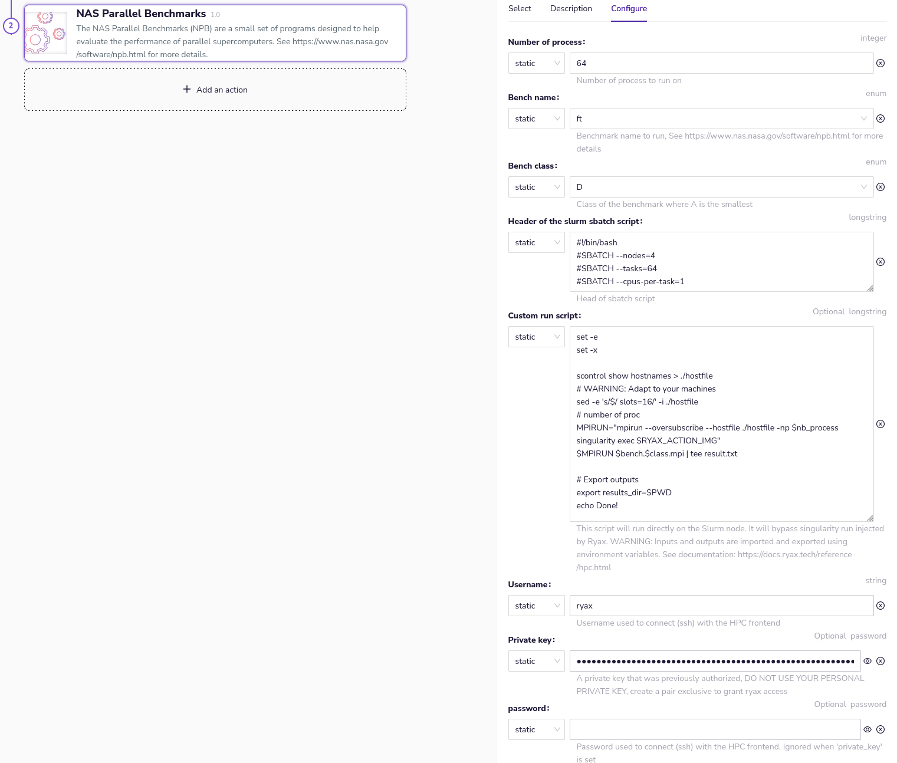

# HPC Offloading

Ryax is able to offload part of a workflow to a High Performance Computing (HPC) cluster. It is especially useful when you need to automate pre and post processing for large simulation.
It means that in the same workflow, some actions will run on Ryax Kubernetes cluster and some will run on an external HPC site through SSH.

!!! note
    Only the SLURM orchestrator is supported for now.

## Requirements

First add a SLURM_SSH site to Ryax using this documentation: [configure and install a Ryax Worker](../howto/worker-install.md#slurm_ssh-worker).

Regarding the SLURM cluster, here is a list of requirements.

1. It requires an SSH access to the frontend node and a shared home directory across nodes to be able to manages Action IO and capture logs.
2. Ryax is leveraging Singularity (a.k.a Apptainer) to package and run containers on the HPC cluster. Thus, you will need Singularity to be installed on the cluster which can only be done by an administrator.
3. Python 3 must present on the frontend because it is required to wrap actions when using the `custom_script` that run directly on the node and not in Singularity.
4. Ryax will create a `.ryax_cache` (can be configured, see [worker configuration](configuration.md#worker-configuration)) folder in your home directory that will contain the container images, the IO, and the working directory of each Run. Make sure that you have enough space on your home (it really depends on your needs).


## Basic Usage

Any Ryax Action is able to run by default on an SLURM_SSH cluster. Once the Worker is configured, just select the SLURM_SSH site on the action's *Deploy* configuration and that's it !
Your action will run in a Slurm job and use one node by default. If you want to run your action in parallel, see the advanced usage.

## Advanced Usage for parallel job

To enable advanced HPC offloading of Ryax Action, you must add the `hpc` add-on to the `ryax_metadata.yaml`:

```yaml
apiVersion: "ryax.tech/v2.0"
kind: Processor
spec:
  # ...
  addons:
    hpc: {}
```

Then, you will be able to set the HPC offloading parameters when you instantiate your action in a workflow.



Your actions will run just like regular Ryax Actions but using a Singularity containers inside the HPC cluster. Slurm runs the containers in parallel following the parameters of the sbatch header (typically setting number of nodes and number of tasks). As usual, Ryax will provide inputs and retrieve outputs upon execution completion.

!!! warning
    If the `custom_script` parameter is set the advanced mode is automatically used. Be sur that this parameter is Null to stay in this mode.


If you want you action to run in parallel on multiple node, for example for an MPI application, you will need to define the `custom_script` parameter. This script will be injected in the sbatch script and run directly on the fronted node. Action inputs will be available as environment variables and outputs must be exported as environment variable at the end of the script. Also, the Singularity image that was built and deployed for you by Ryax is available in the `RYAX_ACTION_IMG` environment variable. The current working directory a temporary folder create for each run.

For example, if you define your action's inputs/outputs like this in your `ryax_metadata.yaml` file:
```yaml
spec:
  inputs:
    - help: Number of process to run on
      human_name: Number of process
      name: nb_process
      type: integer
  outputs:
    - help: Results directory of the tutorial
      human_name: Result directory
      name: results_dir
      type: directory
```

In this example, the `custom_script` can access `nb_process` as bash variable and the `result_dir` is exported at the end:
```sh
set -e # Avoid silent error
set -x # Debug

# Show inputs
echo Number of process: $nb_process

# Generate Hostfile
scontrol show hostnames > ./hostfile

mpirun --hostfile ./hostfile -np $nb_process singularity exec $RYAX_ACTION_IMG

# Export outputs
export results_dir=$PWD
echo Done!
```

To install MPI inside your Singularity image don't forget to add dependencies in your `ryax_metadata.yaml` file:
```yaml
spec:
  dependencies:
  - openmpi
  - openssh
```

The MPI library inside your container must be compatible with the one on the cluster. For more information on why we run MPI this way and the limitation of MPI with Singularity please have a look at the [Singularity documentation](https://docs.sylabs.io/guides/3.3/user-guide/mpi.html).

## HPC Actions repository

You can find examples of HPC enabled Ryax Actions in our public repository:
[https://gitlab.com/ryax-tech/workflows/hpc-actions.git](https://gitlab.com/ryax-tech/workflows/hpc-actions.git)

Contributions are welcomed!
