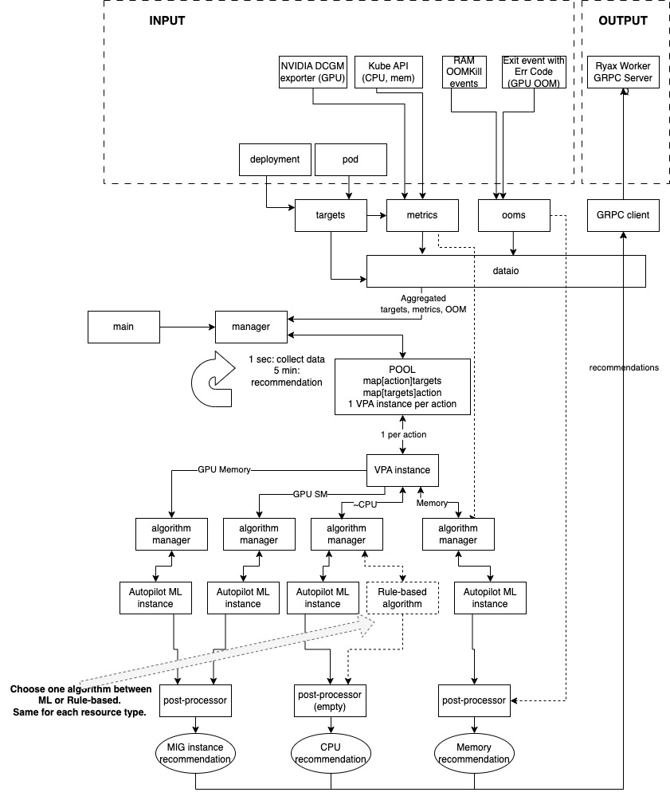

# Ryax IntelliScale

## What is Ryax IntelliScale

**The AI-empowered resource management optimizations within Ryax are brought through Ryax IntelliScale**

Ryax IntelliScale is a *Resilient Vertical Pod Autoscaler* designed for an optimal resource management of the actions of workflows in Ryax. 
For each workflow, Ryax IntelliScale dynamically gives container size recommendation for each resource type of each action, 
based on its automatically collected utilization metrics of these containers. The proposed recommendation tries to be as close as possible to 
the past utilization in order to avoid wasting of resources and fit more pods on the same nodes. Ryax IntelliScale tracks down Out-Of-Memory errors 
and automatically restarts the pod after increasing the memory, hence providing a resilient feature. 

Ryax IntelliScale has been implemented in such a way to simply enable different recommendation algorithms. Currently, the following choices are available:

- *Rule-based algorithm* : where the recommendation is done by a pre-defined statistics based on historical consumption. This algorithm is lightweight and currently more adapted for serverless-based actions.
- *ML-driven algorithm* : where the recommendation is done by machine learning based on historical resource consumption. This algorithm gives more suitable and adaptive recommendation for long-running services, but is heavier than rule-based.

Only one algorithm from the above can be configured as the global recommendation method, at the start of Ryax IntelliScale service. The default version is the Rule-based algorithm.

## How to install and configure Ryax IntelliScale
Ryax IntelliScale is a deployment with 1 pod running in ryaxns namespace. 
The installation of the service is done through Helm and configured as part of the Worker installation. More details on the installation and configuration of worker can be found here [Worker installation Howto](../howto/worker-install.md)


### Common args:

First are the global config for the program.

Format is  Args name (default value) : Description

```plaintext
-v, --v Level (0): Log level verbosity

--kube-api-burst float (10): QPS burst limit when making requests to Kubernetes apiserver (use default unless not work)

--kube-api-qps float (5): QPS limit when making requests to Kubernetes apiserver (use default unless not work)

--kubeconfig string (""): Path to a kubeconfig. Only required if out-of-cluster (use default unless not work)

--namespace-consider string (""): Namespace where the scaled actions locates ("" for considering all namespaces). DONT EDIT DIRECTLY. THIS SHOULD BE SET BY HELM CHART values.yaml:  .Values.ryax.worker.actionNamespace

--enable-monitoring (false): Enable VPA to export Prometheus metrics. After enable this, Prometheus server can fetch metrics from port 8080. NOTICE: spec.template.spec.containers[0].ports.containerPort:8080 needed in yaml if enabled monitoring

--vpa-instance-expire-duration duration (48h0m0s): Expiration duration for unused VPA instance (1 per action). If for an action no new active pods after this duration, the VPA instance is deleted to save memory

--recommend-interval duration (5m0s): Interval of aggregation and recommendation

--record-interval duration (1s): Interval of fetching metrics, targets and OOMs

--ap-coldstart-n int (0): Cold start, No recommendation before this amount of aggregations (time is N*5min)

--ryax-worker-grpc-host string ("ryax-worker.ryaxns") : GRPC host of ryax worker. DO NOT MODIFY HERE. CONFIG IN HELM CHART values.yaml: .Values.ryax.worker.serviceName

--ryax-worker-grpc-port string ("8326") : GRPC port of ryax worker 

--ryax-worker-grpc-timeout duration (1s) : GRPC timeout to send recommendations to ryax worker

```

Then we need to select what resources we want to autoscale among CPU, Memory and GPU MIG instance. If some resource is enabled (e.g. GPU) but there's actually no this resource in the cluster, or the workload doesn't use this resource, it will simply be ignored.

```plaintext
--scaled-resource-types string (default "cpu,memory") : Comma separated list of scaled resource types, choose from cpu, memory and gpu_mig_instance.
```

After setting scaled resources, we can configure some resource-specific args. We can choose only selected resource types among the args below.

```plaintext
--bumpup-ratio float (1.2): [For Memory] recommendation value bump-up ratio when OOM happens

--bumpup-timeout duration (10m0s): [For Memory] Timeout for finishing OOM bump-up. If no other OOM happens in this duration, the memory recommendation will recover to raw recommendation

--ap-cpu-histogram-bucket-num int (400): [For CPU] Num of buckets in linear histogram of CPU

--ap-memory-histogram-bucket-num int (800): [For Memory] Num of buckets in linear histogram of memory

--gpu-bumpup-timeout duration (15m0s): [For GPU MIG instance] Timeout for finishing gpu OOM bump-up. If no other GPU OOM happens in this duration, the MIG instance recommendation will recover to raw recommendation.

--gpu-mig-instances-support string ("1g.10gb,3g.40gb,7g.80gb") : [For GPU MIG instance] Comma separated list of all GPU MIG instances that we want to support. This should be the subset of all supported MIG profiles by the GPU. THIS LIST SHOULD BE SYNCHRONIZED WITH RYAX PLATFORM. DONT MODIFY HERE. SHOULD BE SET IN HELM CHART values.yaml: .Values.config.MIG.supportedInstances

--gpu-oom-error-code int (26) : [For GPU MIG instance] When the user program inside container encounters an GPU OOM kill, it should return with this error code to let VPA know the occurance of the GPU OOM. Because GPU OOM is only handled by user program not the linux. The VPA cannot know from Kubernetes unless the user raises this code by themselves. Code number range should be 1 to 255.
```

```plaintext
--vpa-algorithm string ("rule"): Recommendation algorithm: 'rule' for Rule-based, 'ml' for ML-driven
```

If we choose to use the Rule-based algorithm (`--vpa-algorithm=rule`), then we also need

### Specific args to config this rule-based algorithm: (These should be appened to the common args)

We can only consider those corresponding to selected resources. If there is "cpu" in thr arg name. it's for CPU resource. And "memory" for Memory. "gpumemory" for GPU MIG Instance.

```plaintext
--ap-cpu-histogram-decay-half-life duration (48h0m0s): Time for a historical CPU sample to lose half its weight

--ap-memory-histogram-decay-half-life duration (24h0m0s): Time for a historical memory sample to lose half its weight

--ap-cpu-lastsample-n int (5): Sliding window length N for CPU (for calculate maximum and decaying). See Autopilot Paper

--ap-memory-lastsample-n int (5): Sliding window length N for CPU (for calculate maximum and decaying). See Autopilot Paper

--ap-cpu-recommend-policy string ("sp_90"): CPU recommendation policy (see Autopilot Paper): 'avg', 'max', 'sp_xx', or 'spike'

--ap-memory-recommend-policy string ("sp_98"): Memory recommendation policy (see Autopilot Paper): 'avg', 'max', 'sp_xx', or 'spike'

--ap-fluctuation-reducer-duration duration (1h0m0s): Sliding window length of fluctuation reducer. See Autopilot Paper

--ap-gpumemory-histogram-decay-half-life duration (default 48h0m0s) : The amount of time it takes a historical GPU Memory usage sample to lose half of its weight.

--ap-gpumemory-lastsample-n int (default 5) :  N last GPU Memory samples in Autopilot paper 

--ap-gpumemory-recommend-policy string (default "sp_98") : choice among`: 'avg', 'max', 'sp_xx' where xx is the percentile, 'spike' which is max(sp_60 , 0.5*max)

--gpumemory-histogram-bucket-num-per-gcd-rule int (100) : For GPU memory resource histogram in rule-based algorithm, the number of buckets per gcd (the greatest common divisor of all gpu-mig-instance-support list). The larger this value, the more fine-grained raw recommendation, but with more memory consumption.

--ap-gpumemory-histogram-decay-half-life duration (default 48h0m0s) : The amount of time it takes a historical GPU Memory usage sample to lose half of its weight.

--ap-gpumemory-lastsample-n int (default 5) :  N last GPU Memory samples in Autopilot paper

--ap-gpumemory-recommend-policy string (default "sp_98") : choice among`: 'avg', 'max', 'sp_xx' where xx is the percentile, 'spike' which is max(sp_60 , 0.5*max)
```

If we choose to use the ML-driven algorithm (`--vpa-algorithm=ml`), then we also need

### Specific args to config ML algorithm: (These should be appened to the common args)

We can only consider those corresponding to selected resources. If there is "cpu" in thr arg name. it's for CPU resource. And "memory" for Memory. "gpumemory" for GPU MIG Instance.

```plaintext
--hparam-cpu-d float (0.5): Hyper-parameter d of the ML model for CPU

--hparam-cpu-wdl float (0.5): Hyper-parameter wdeltal of the ML model for CPU

--hparam-cpu-wdm float (0.5): Hyper-parameter wdeltam of the ML model for CPU

--hparam-cpu-wo float (0.5): Hyper-parameter wo of the ML model for CPU

--hparam-cpu-wu float (0.5): Hyper-parameter wu of the ML model for CPU

--hparam-memory-d float (0.5): Hyper-parameter d of the ML model for memory

--hparam-memory-wdl float (0.5): Hyper-parameter wdeltal of the ML model for memory

--hparam-memory-wdm float (0.5): Hyper-parameter wdeltam of the ML model for memory

--hparam-memory-wo float (0.5): Hyper-parameter wo of the ML model for memory

--hparam-memory-wu float (0.5): Hyper-parameter wu of the ML model for memory

--hparam-gpumemory-d float (0.5) : hyper-parameter d for Refined Autopilot ML GPU Memory

--hparam-gpumemory-wdl float (0.5) : hyper-parameter wdeltal for Refined Autopilot ML GPU Memory

--hparam-gpumemory-wdm float (0.5) : hyper-parameter wdeltam for Refined Autopilot ML GPU Memory

--hparam-gpumemory-wo float (0.5) : hyper-parameter wo for Refined Autopilot ML GPU Memory

--hparam-gpumemory-wu float (0.5) : hyper-parameter wu for Refined Autopilot ML GPU Memory

--ml-cpu-num-dm int (50): Number of different d_m values in models for CPU. Total number of models = dm * mm. See Yuqiang master report.

--ml-cpu-num-mm int (400): Number of different m_m values in models for CPU. Total number of models = dm * mm. See Yuqiang master report.

--ml-cpu-size-buckets-mm int (1): 1 safety margin value aligned to how many bucket sizes. Usually 1. See Yuqiang master report.

--ml-memory-num-dm int (50): Number of different d_m values in models for Memory. Total number of models = dm * mm.

--ml-memory-num-mm int (400): Number of different m_m values in models for CPU. Total number of models = dm * mm.

--ml-memory-size-buckets-mm int (1): 1 safety margin value aligned to how many bucket sizes. Usually 1.

--gpumemory-histogram-bucket-num-per-gcd-ml int (100) : For GPU memory resource histogram in ML algorithm, the number of buckets per gcd (the greatest common divisor of all gpu-mig-instance-support list). The larger this value, the more fine-grained raw recommendation, but with more memory consumption. 

--ml-gpumemory-num-dm int (default 50) : Number of different models = num-dm * num-mm 
```

### Example args setting:

There are some example args that works very well in the directory **charts/values.yaml**. The one not commented in **vpaArgs** entry is a good example for rule-based algorithm on CPU RAM and GPU resources.

## API

The input of Ryax IntelliScale comes from the annotations of the target *workload deployment* of actions:

To let a deployment being auto-scaled, we (or Ryax worker) should set these 2 annotations in deployment. VPA will automatically detect the ones with these 2 annotation:

```yaml
# The unique key for an action. Inside VPA, all deployments(pods) with the same recommender_input are autoscaled together, giving the same recommendation values.
ryax.tech/recommender_input: 'sample_key'
# The initial amount of resources that users set. This value worked as container size of VPA is under cold-start, or VPA has temporary error to recommend a value.
ryax.tech/user_resources_request: '{"cpu": 0.1, "memory": 2147483648}'
```

The output of Ryax IntelliScale (the recommendations) is directly sent to Ryax Worker by GRPC protocol every 5 minutes. Need to correctly configure the GRPC server address of Ryax Worker.

Ryax IntelliScale component does not apply the recommendation to the pods. This will be done by Ryax Runner and Worker component to read recommendation and schedule coming executions.

## Ryax IntelliScale behaviour and architecture

After Ryax IntelliScale is deployed, we can directly apply the deployments of the to-be-scaled workload, with the annotations as given above. They can be automatically detected and processed as:

- **Every 1 second**, Ryax IntelliScale fetches current existing workload instances and their resource consumption data. 
- **Every 5 minutes since Ryax IntelliScale started**, (either Rule or ML algorithm,) the recommendation is calculated and sent to Ryax Worker. So when a workload to be scaled is deployed, we should wait *at most 5 minutes* to get the first recommendation.

More detailed architectures and implementations are shown in the figure and described below. The intervals above can all be configured (but not recommended).



### Temporal description of the architechture
Every 1 second: to collect scaled targets, metrics, and OOMs from Kubernetes API and NVIDIA components (can be configured by `--record-interval`). 

Every 5 minutes: (can be configured by `--recommend-interval`), the algorithm aggregates the histograms in the past 5min interval, run the algorithm and send recommendation of all workloads to the GRPC server. 

### Spatial description of the architechture

The **dataio** module is used for the input and output interactions with outside (Kubernetes API, DCGM Exporter and GRPC server).

The **vpainstance** module is the logical model of an auto-scaled unit. 1 *vpainstance* serves 1 action, identified by the annotated key on deployment. A *vpainstance* holds an *algorithm instances* for autoscaling each resource type. All of these *algorithm instances* can be configured as Rule-based or ML.

As downstream of recommendation (either by Rule-based or ML), there is **Memory Postprocessor** for memory resource and **GPU Postprocessor** for GPU MIG instance. **Memory Postprocessor** takes the OOM event and last pod size, bumps it up temporarily as new recommendation value. After `bumpup-timeout`, the bumped-up value will expire, and recovers the memory recommendation as the raw output of the algorithm. **GPU Postprocessor** receives the recommended GPU Memory size, then capping this value with the smallest possible MIG instance. When GPU OOM happens, this postprocessor does a similar bump up behaviour as the Memory post processor.

The **vpainstance pool** holds all the **vpainstances**, manages the pools (allocation, garbage collection) and the map between Kubernetes objects, Ryax executions and VPA instances.
