# API Trigger

This tutorial presumes you are acquainted with basic Ryax concepts like workflow, actions, and triggers.
For more information on these concepts see https://docs.ryax.tech/concepts/concepts.html.

The http API trigger allows users to create an API to listen for user data. By design Ryax creates an
API server per project and each workflow can implement one endpoint. To use this feature 
build the [http_api_json](https://gitlab.com/ryax-tech/workflows/default-actions/-/tree/master/triggers/http_api_json) 
trigger from default-actions. If you are already familiar with the process you can skip to Part II.

## Part I - Build HTTP API JSON action

Login onto Ryax UI and click on `Library`

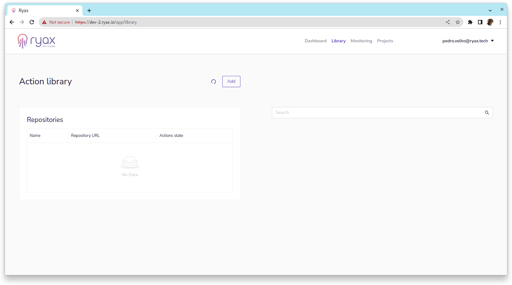

Click on `Add` set name as `default actions` and the url as  
https://gitlab.com/ryax-tech/workflows/default-actions.git and then click on `OK`.

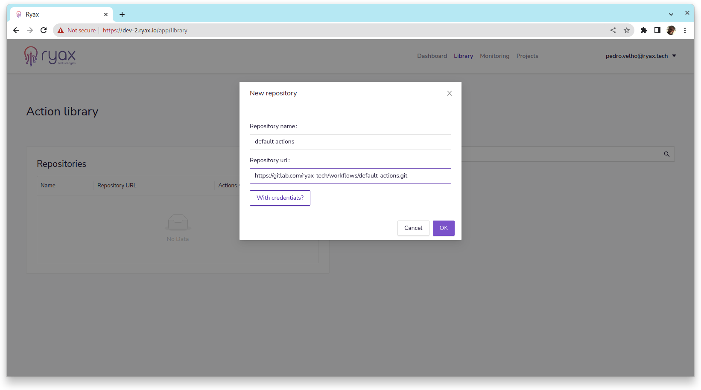

Now click on the Repository that appears on the list and click on `Scan now`. Select the branch to 
scan, master is the default, and click `OK`.

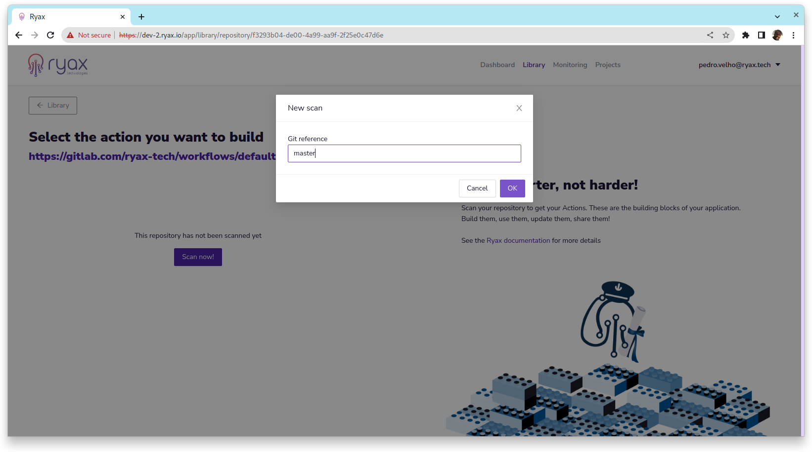

You will be presented with a list of actions/triggers found. Click on `HTTP API JSON` and click on `Build` on the left.

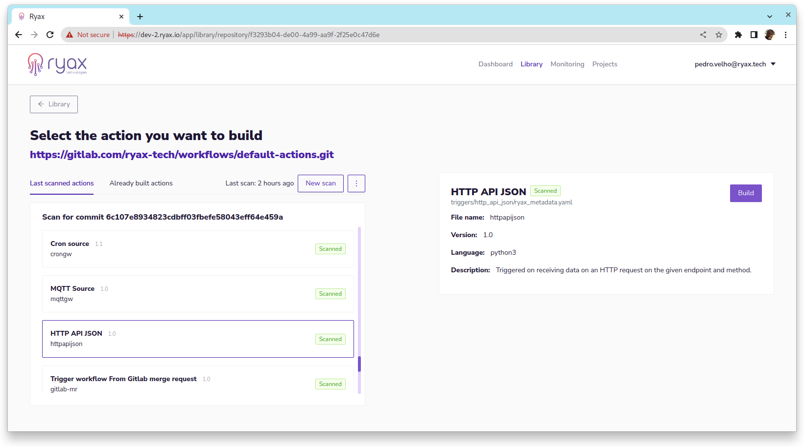

## Part II - Create endpoint workflow

Now that you already have `HTTP API JSON` trigger available you can create
a workflow that implements a simple endpoint. We will create a simple POST that echo the input value as
an output result.

To start click on `Dashboard` and create workflow.

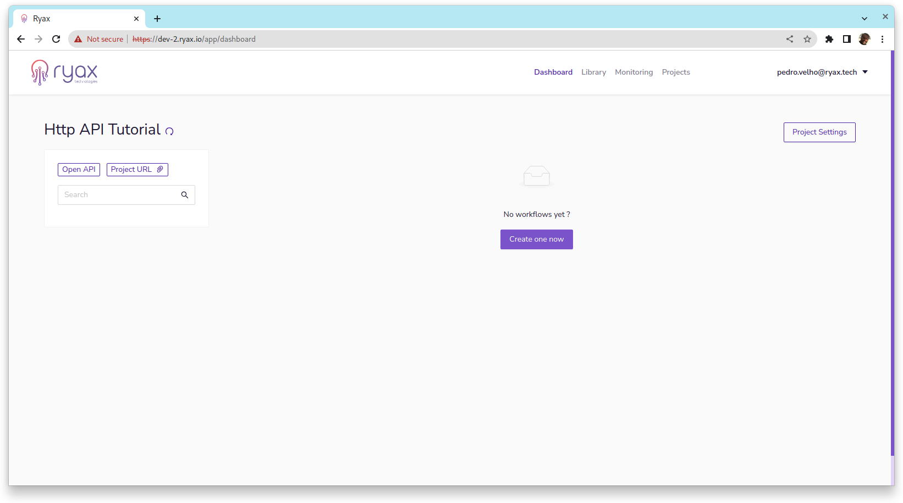

Select a name and choose as trigger the `HTTP API JSON` trigger built in Part I. 
Edit workflow name to `Echo POST`, fulfill OpenAPI doc parameters summary, tags and description.
Template endpoint is the endpoint rightmost part, to append on the project URL, we used `/echo/post`.
Select the method as `POST`, you can leave `HTTTP success status code` and `Asynchronous Reply Timeout`
to their default values.

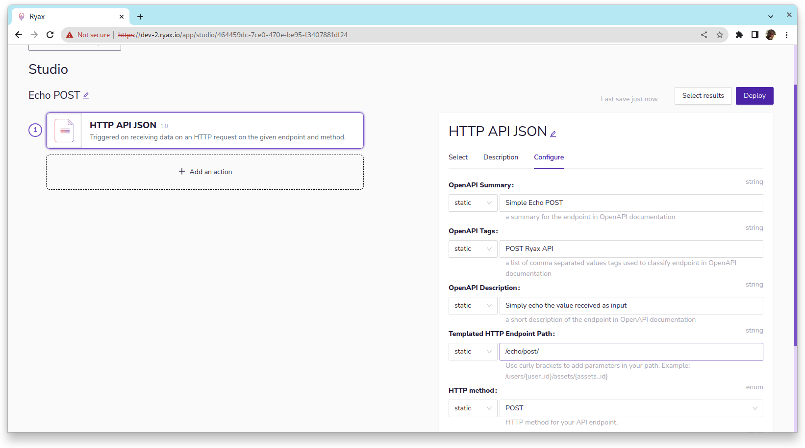

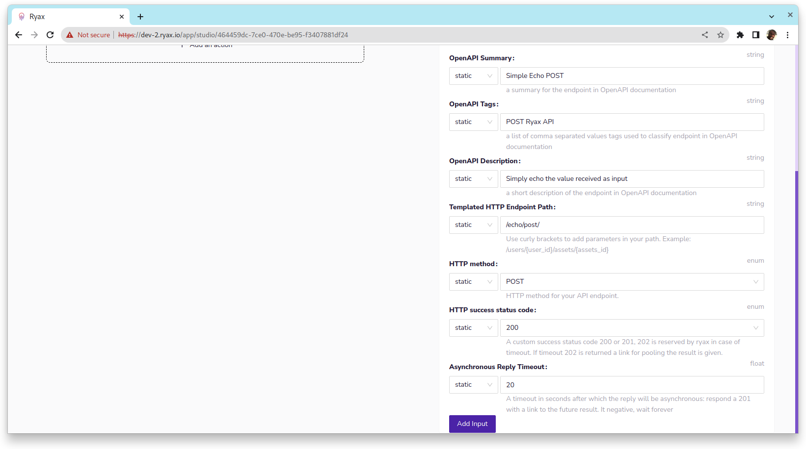

Now let's add a simple string input. Click on `Add input`. 
Define a name, this will be the name to use on the json 
so make sure it has json valid characters. Choose a help text, select 
`body` as `Origin` and `type` as string. 

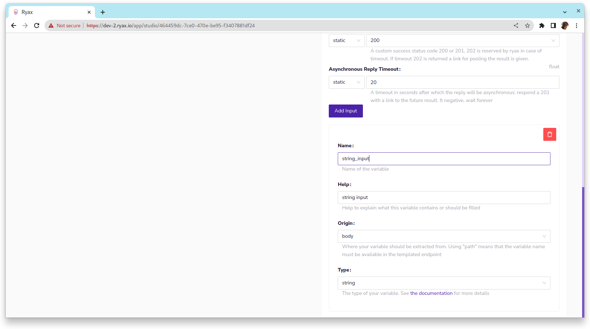

We are almost ready to deploy and use this workflow as an API. However, we still need to
associate a result value to the workflow. To do that, on the top of the workflow edit page, 
click on `select results`. Then select JSON, set key as any json valid name and select the previously
created input on the combo box.

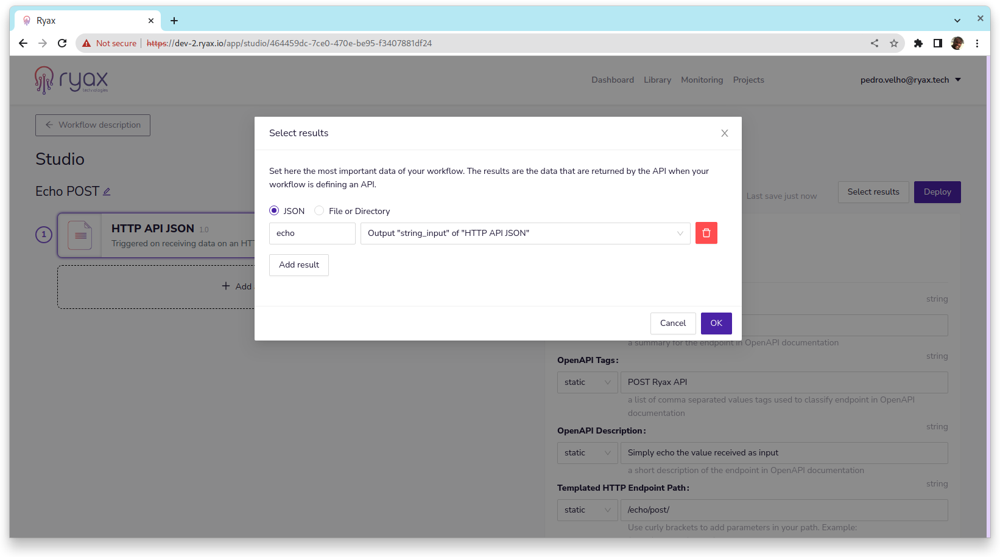

Back on the dashboard the project OpenAPI link is on the top left, below
the project name, click on `Open API` to see the automatically generated
documentation.

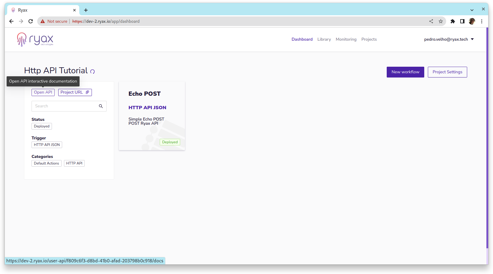

The screenshot below shows the endpoints `/echo/post/` as configured
on `Echo POST` workflow. If you undeploy the workflow and refresh
the documentation page the endpoint will be removed from the OpenAPI doc
page. 

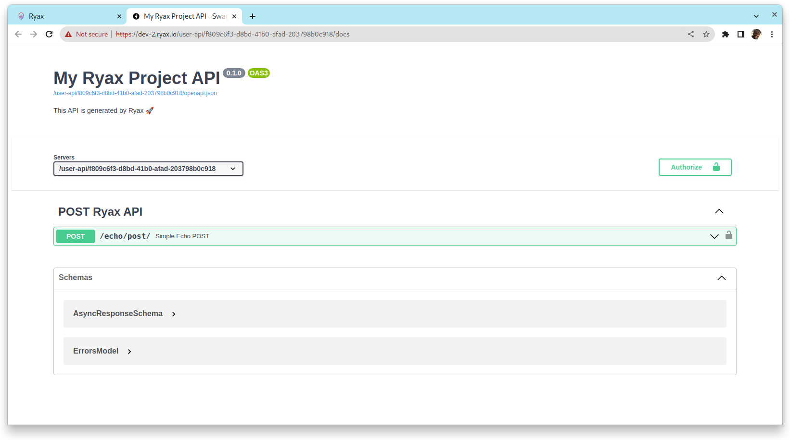

With the OpenAPI doc you can easily try the `Echo POST` workflow.
Just click `Try it out` and type some relevant info as "string_input" value on the 
json payload, then click on `Execute`. After executing the full workflow
the response payload should contain a json with `echo` result, the value
of `echo` matches the input.

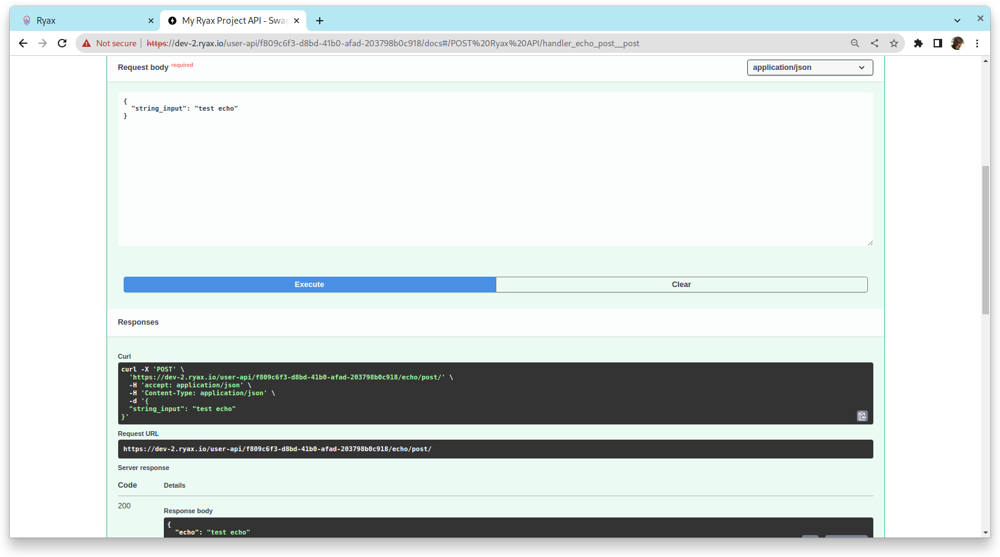

Finally, you can also check execution details on Ryax as we see below. 

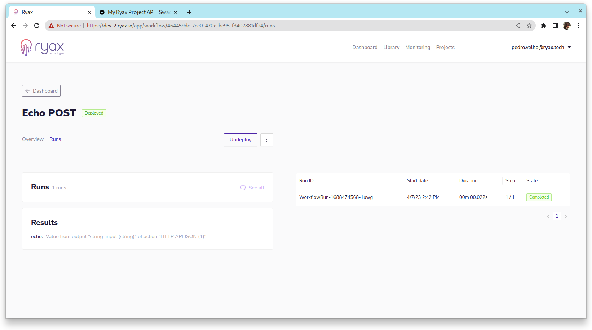

## Conclusion and further reading

It is possible to configure the return status code to 200 or 201, 202 is reserved
by Ryax to retrieve the result in asynchronous mode. It is also possible
to set error codes by raising RyaxException from any action that follows
`HTTP API JSON` trigger. For more information on that please visit
[the concept documentation page](https://docs.ryax.tech/concepts/concepts.html#api-http-json) on the subject.
