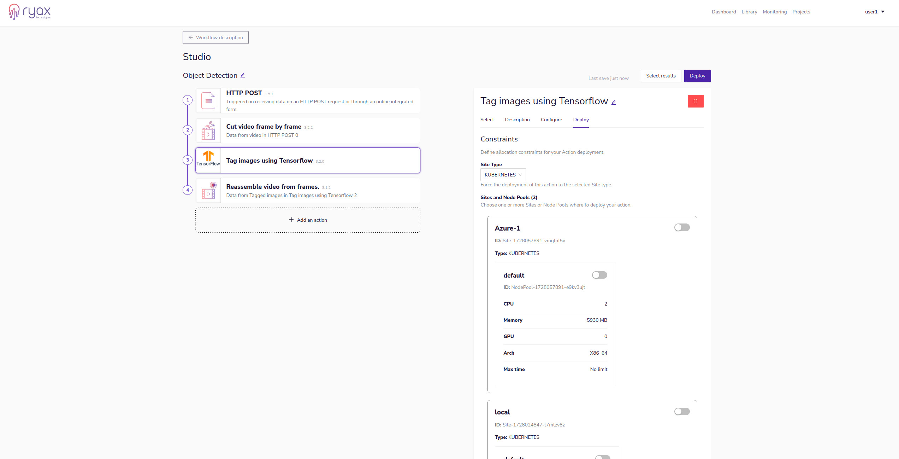
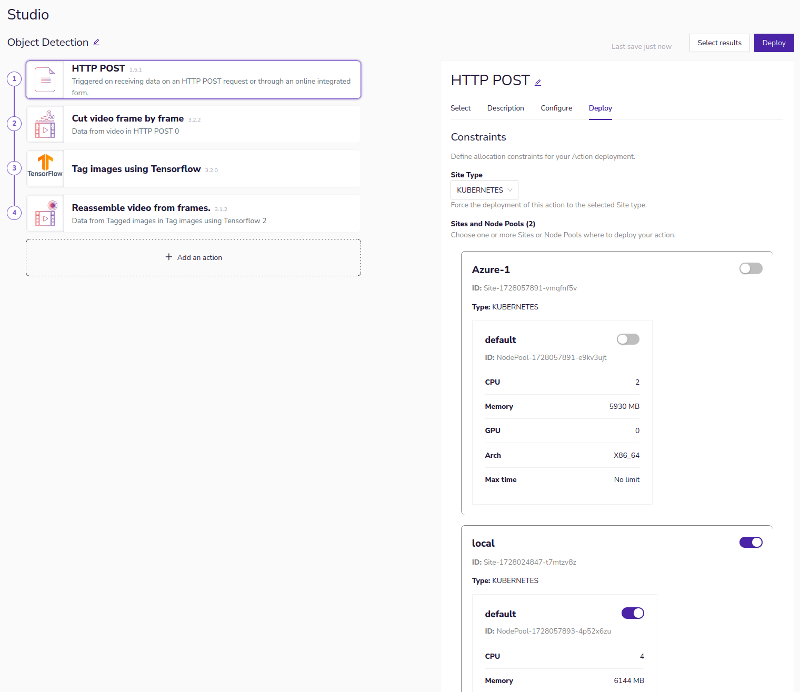
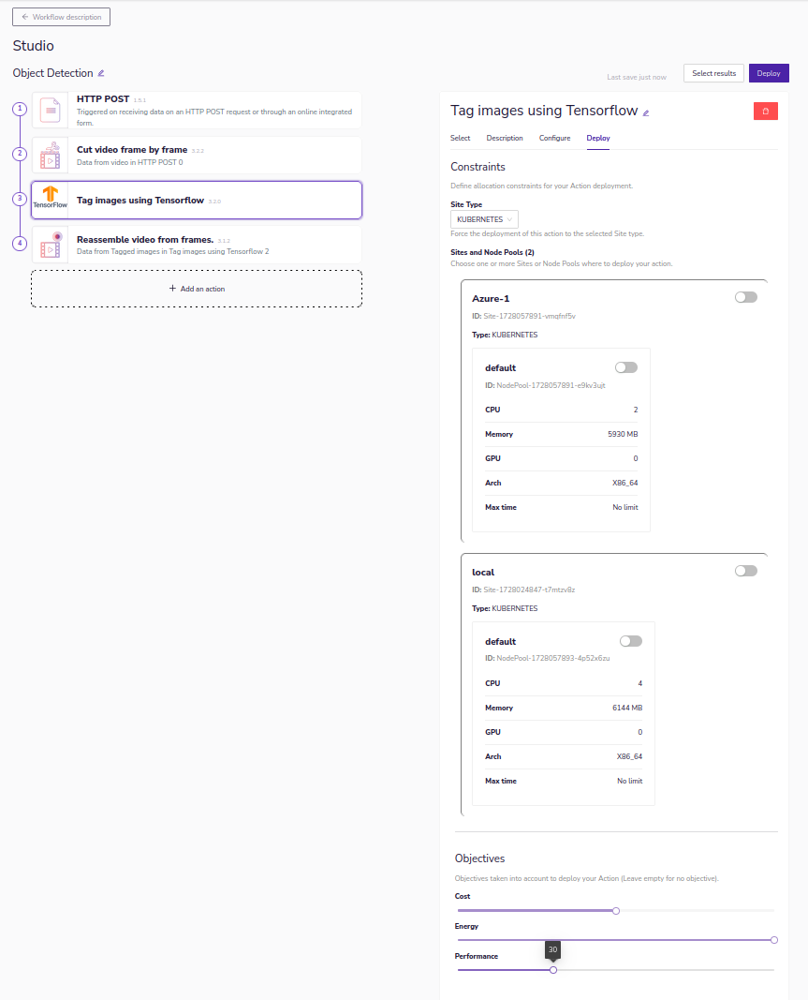
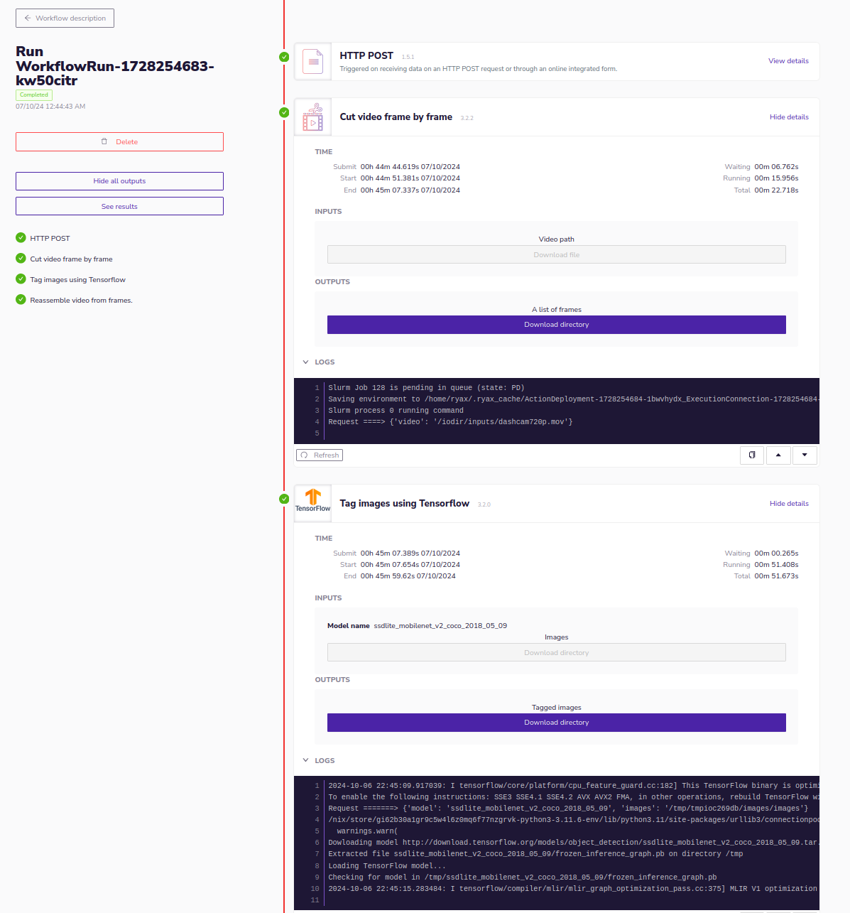
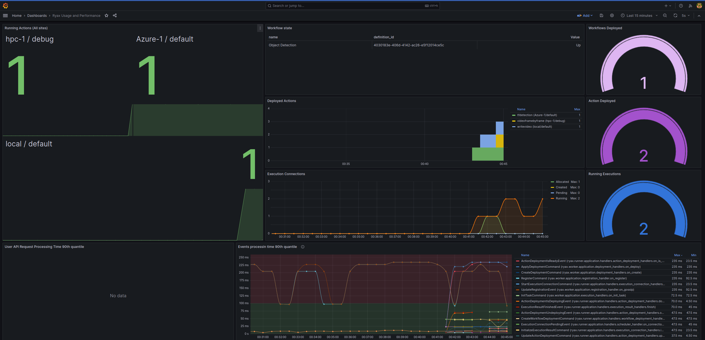

# Workflow executions on multiple sites 

This section describes how a user can configure a workflow to have its actions seamlessly distributed on different sites (controlled by different orchestrators). The ability of Ryax to enable the execution of workflows on multiple sites,
having actions executed on different clusters, in a transparent to the user way, is an important added value of Ryax platform. This feature mainly enables each action to be executed and controlled on different sites based on the needs of the workflow.
Following the administrator configuration for the particular Ryax instance, users will have the ability to select from a list of sites and node-pools upon which they can execute the workflow's actions.

In particular the user has the ability to either set constraints, specifying which site and node-pool to select for each action; or set objectives, specifying weights for each objective and letting the scheduler to select the most adapted option based
internal scheduling logic.

Following the architecture of Ryax as described in [Ryax internal architecture](../reference/architecture.md) the 
global orchestration of workflows and actions is done by the runner residing on the master Ryax site. The runner service will delegate the execution on the different available orchestrators of each site it is configured. 
The orchestrator may be either Kubernetes (for typical Cloud, edge or on-premises sites) or Slurm (for HPC sites). 
Besides the selection of orchestrators and sites, users have the ability to select amongst the different node-pools which are configured on each site controlled by Kubernetes or different partitions which are configured
on each site controlled by Slurm.

## Constraints: Configure an action to be executed on a particular site 

The configuration of the action's execution parameters, regarding the site placement of the execution, is done through the `Deploy` tab. We consider a typical workflow performing object detection on videos and we check how to select the sites
to deploy each action.

In this `Deploy` category of parameters, you can select the orchestrator (either Kubernetes or Slurm) and based on that selection, different choices regarding node types will be opened. 

### Constraints: Select node-pools for Kubernetes managed sites

In the case of Kubernetes the different configured sites and
within them various node-pools will appear as a selection. 
Clicking on the activation/deactivation button on the top right of each node-pool or on the top right of each site will set a constraint on that particular level.

Following on this "hard" constraint, when you click on the Deploy button at the top right of the workflow the particular action will be deployed where you have configured it to do so.    
### Constraints: Select partitions for Slurm managed sites

In the case of Slurm the different configured sites and within them various partitions will appear as a selection. 

Clicking on the activation/deactivation button on the top right of each partition or on the top right of each site will set a constraint on that particular level.

Similarly to the Kubernetes case once selecting Slurm site or parition as "hard" constraint, the action will be deployed there through an ssh connection to the site and an adapted sbatch script submission using the appropriate parameters.

Even if the underlying executions are not done in the same way when using Kubernetes or Slurm orchestrators; Ryax brings the necessary abstractions in order to facilitate the user and allow them to provide one code which will then be packaged in
different ways to be executed either on Kubernetes for typical Cloud-native deployments (based on Docker-based containers) or on Slurm for typical HPC deployments (based on Singularity or Apptainer containers).

## Objectives: Configure an action to be scheduled by the Ryax scheduler

The constraints explained previously provide the means to execute precisely where a user needs to do so. Now in some cases users may not have the expertise to have a view on where to execute or they may need an optimal decision based on some metrics.
In Ryax we have implemented a multi-objective scheduling technique to address exactly this need. In particular the technique is based upon a formula considering objectives' scores configured per site and combined with objectives weights 
as given by the user. Based on that Ryax offers the ability to configure different scheduling policies to perform the resources/actions matching (placement).

Currently 3 objectives are defined and the user can configure them per action. These are the following:

- **Cost**: Meaning cost minimization. The higher the percentage the bigger weight you give in cost minimization, hence the scheduler will favor sites and resources with lower cost.
- **Energy**: Meaning energy efficiency improvement. The higher the percentage the bigger weight you give in energy efficiency, hence the scheduler will favor sites and resources with higher energy efficiency. 
- **Performance**: Meaning performance increase. The higher the percentage the larger weight you give in performance, hence the scheduler will favor sites and resources with higher performance.

The combination of all 3 objectives and their respective weights, based on the needs of the application, will allow the scheduler to provide the most adapted resources as calculated through the  score-based multi-objective scheduler of Ryax. 
In the figure the user expressed the need for 50% weight on cost optimizations, 100% on energy efficiency and 30% Performance focus which will favor nodes with 
increased energy efficiency while giving a bit importance to cost optimization and less importance to performance.   

## Inspection of multi-site workflow executions

Once the Deployment is done and the triggering of the execution is submitted we can inspect each actions' execution, on their respective site where it is orchestrated, through the centralized interface of Ryax. 
We can follow both the logs of the executions on the remote sites, through the interface, as long as the resources monitoring of all involved sites, through adapted visualization dashboards. 

### Centralized debugging of actions' multi-site executions

To follow the real-time logging of the actions' executions you need to go to the Runs in the workflow view and click on the particular execution that you are interested to follow. Then you can click on `View Details` of each action that you
are interested to inspect and then `See logs` to get the logs of the container execution on the remote site. 

The logs are returned in real-time. In the case of Slurm the system fetches new inputs in the log file where sbatch logs the errors and outputs. The particular example shows the logs 
of the first action executed on an HPC site by Slurm and the second action executed on a Cloud site by Kubernetes. Both results are returned to the user through the same way.   

### Centralized resources monitoring of actions' multi-site executions

To follow the real-time resources monitoring and how the actions are delegated on the different sites you can do that by clicking on the `Monitoring` tab at the top right. This will open a new page where a grafana interface will be opened.
Once initiating with your user credentials you can click on the Dashboards and then on the particular dashboard named: `Ryax Usage and Performance` which is specifically added to show how the actions are distributed on the different configured sites.

The particular dashboard shows the example of object detection where the 1st action is offloaded to HPC site managed by Slurm, the 2nd delegated to an Azure Cloud and the 3d deployed on the local Kubernetes system.

