# Quick Start Guide

**Deploy your first workflow-based application with Ryax**

This tutorial introduces you to the essentials of Ryax usage through its web interface by creating a workflow for an application performing object detection on videos using AI techniques. The goal of this workflow is to process a video to detect objects displayed on the video.

As an example, we will create a workflow called "Detect objects on videos": it will allow users to upload their own videos, run object detections on them using AI-based inference, recreate the videos featuring the detected objects and upload them onto an external object store.

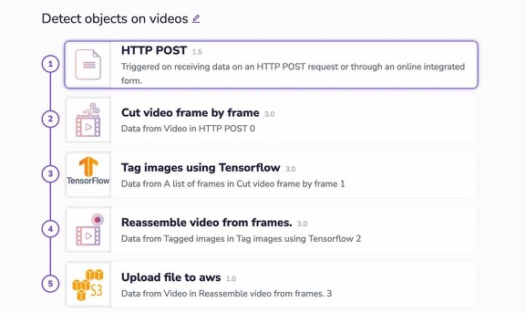

Here is a step-by-step description of this AI-based workflow:

- Open an upload form for users to input their video.
- Cut the video frame by frame to allow single-image processing by the object detection algorithm.
- Run video frames through a Tensorflow-based object detection inference
- Reassemble the frames into a result video.
- Upload result video to an AWS S3 bucket

!!! tip
    For more information about this workflow, please refer to its complete [documentation](../howto/video_detection.md).

## Assembling our first workflow

In this first part of the guide, we will assemble a complete workflow only using existing default public actions in Ryax.
To start with, let's log into Ryax and create a new workflow from the Dashboard page by clicking on "Create one now":

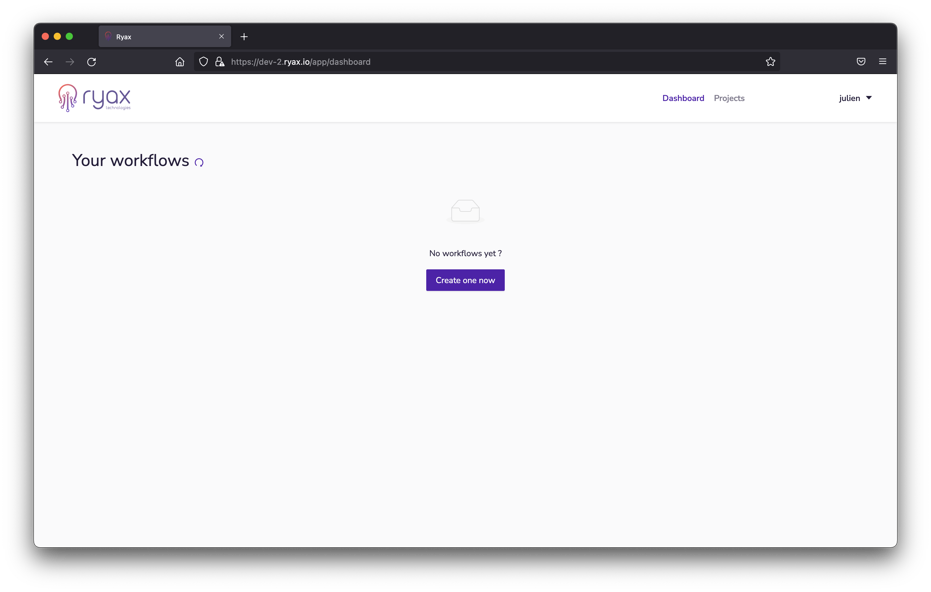

For example, we'll name this new workflow "Detect objects on videos".

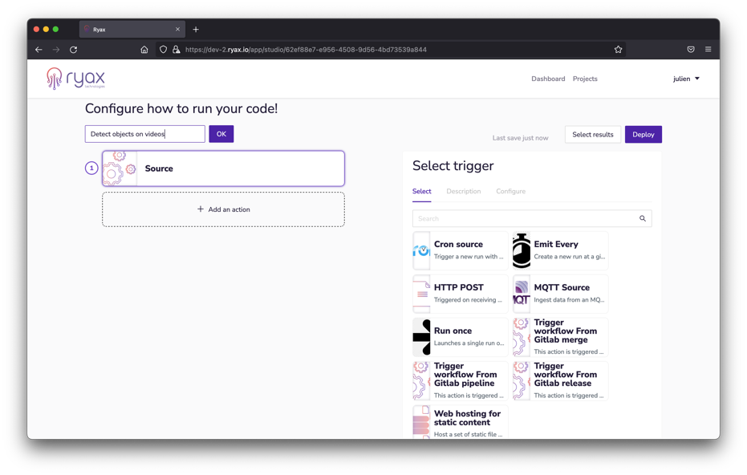

Click "OK", you are now ready to start assembling your workflow!

### Defining the workflow's trigger

The first 'step' of a Ryax workflow is called a 'trigger'. Triggers are the principal part of our automations, they allow for controllable, precise, reliable actuations of a processing chain. Triggers actively listen for external events or user inputs such as API calls, data movements on a server, messages, database updates (etc) and start the workflow when specified.

In our platform, building your workflow will mean choosing a trigger to start with: and you’ll do it with the panel you see on the right. Lots of options to choose from.

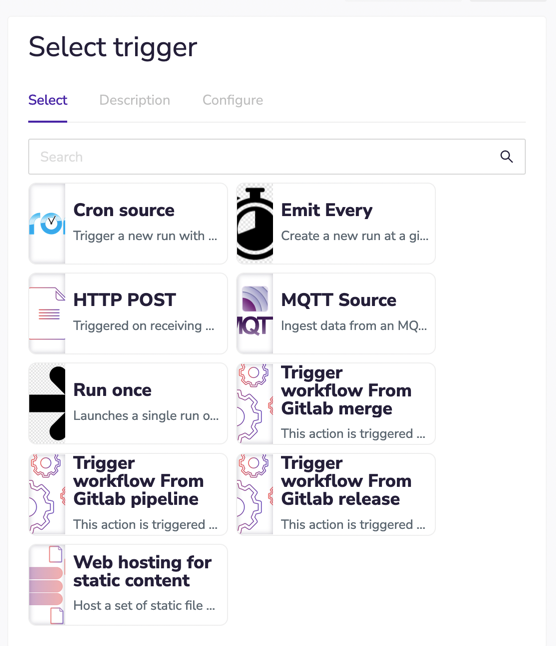

!!! tip
    For more details on Ryax concepts, take a look at the [Ryax concepts](../concepts/concepts.md).

For our example, we'll choose an "HTTP POST" trigger:

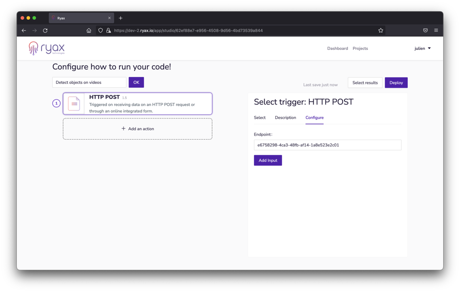

This trigger will generate and display a UI form that users can interact with. You can check out the "Description" tab to the right for a quick description of any action or trigger in Ryax.

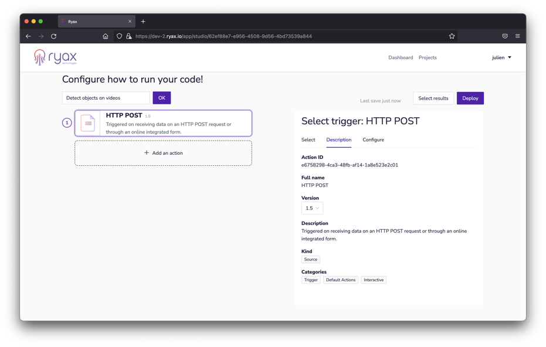

Now we'll configure the form so it can take files as inputs, let's go back to the "Configure" tab and click the "Add Input" button:

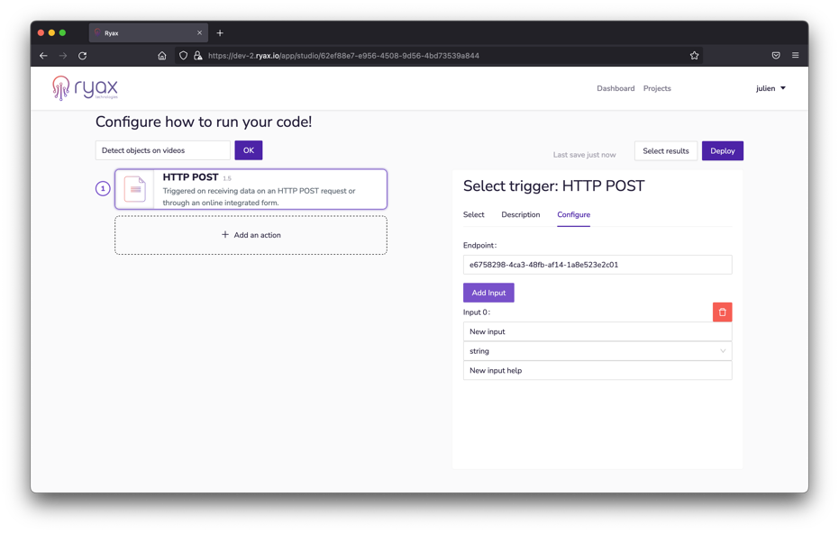

Since we want users to be able to upload video files to our form, we'll selection "file" as the Input 0 type:

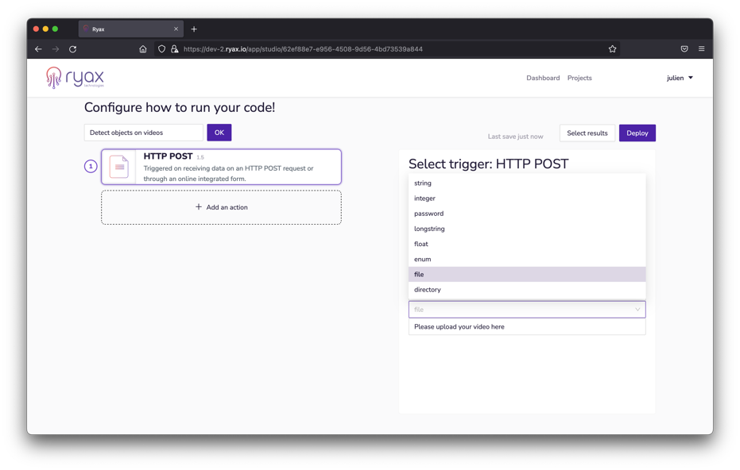

We also used the other fields to name and describe the expected user input while we were at it: this will help users know what the form will actually do.

### Adding actions to our workflow

Next step is to add actions to the processing chain.

In Ryax, actions perform automated operations like sending messages, storing data, executing an ML algorithm, training a model, branching in a Git, perfoming a search, etc.
Actions can ingest data from any given point of a workflow, process it and pass it downstream for another action to take over. Chaining actions up together is what truly creates end-to-end backend automations!

!!! tip
    For more details on Ryax concepts, take a look at the [Ryax concepts](../concepts/concepts.md).

To add our first action, we'll click on the "Add an action" button at the bottom of our workflow:

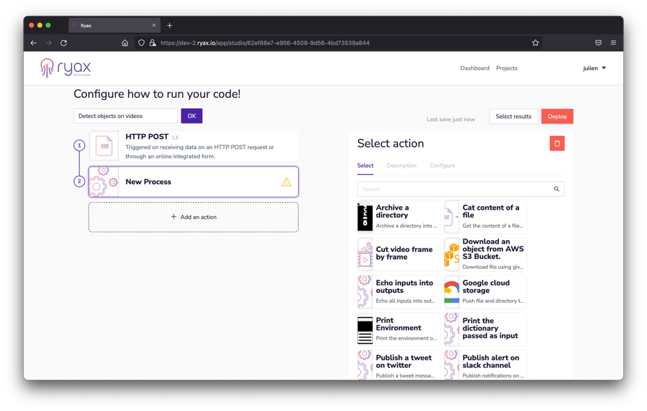

This will lead us into the action selection pane to the right. At this point we want to cut the video frame by frame, so we can search for "cut..." in the search box:

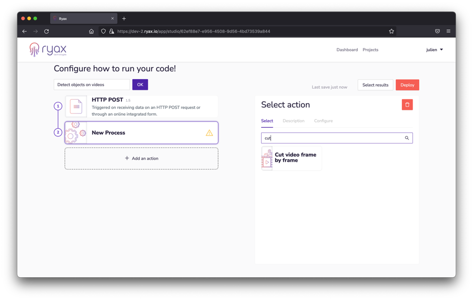

Let's click the "Cut video frame by frame" action to add it to our workflow.
We're automatically shown the "configure" tab that'll allow us to set up the action. Now, we want this action to ingest the uploaded video and process it. The way to do it in Ryax is to use the "link" input type: this allows us to use any data point of our workflow as an input to an action. Let's choose the "link" option for our video's path:

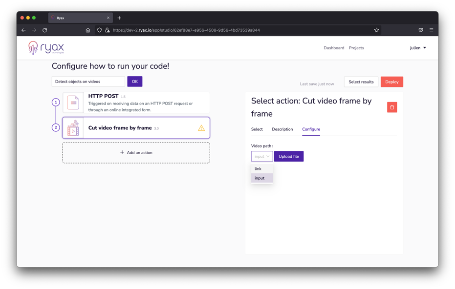

Now we are able to choose the previous action's output: the video uploaded by our user. We can select the "video" output from the action "HTTP POST 0":

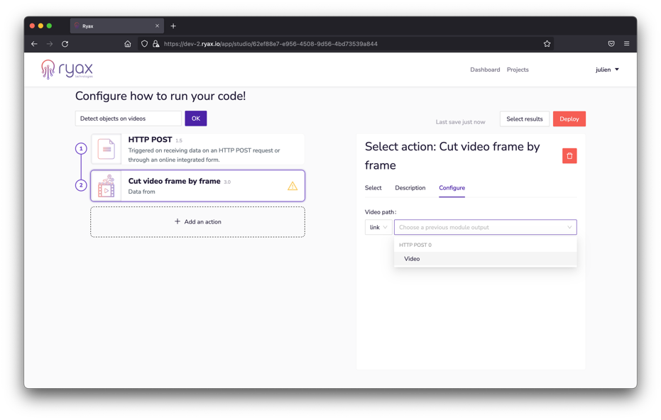

Our "cut video" action is set up and working at this point :-)

Let's add another action below: we'll choose the "Tag images using TensorFlow" algorithm.

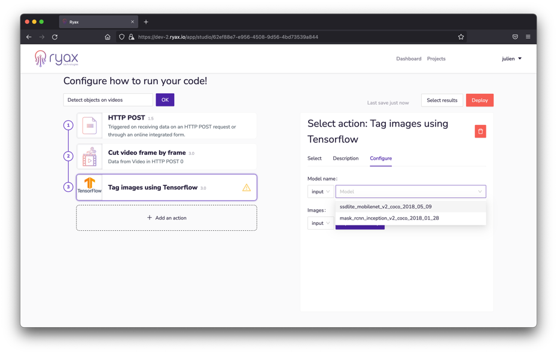

Two different models are available for this algorithm, we'll choose the MobileNet version for now.
In the same spirit as before, we'll choose the 'link' input type for the 'images' input of this action:

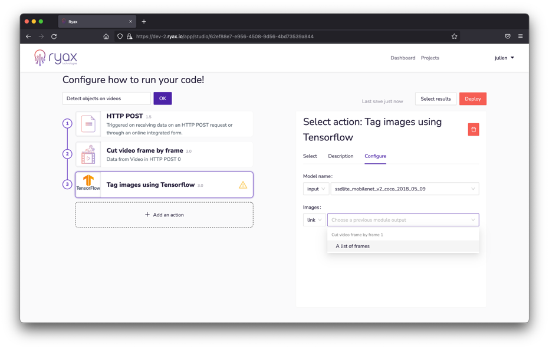

Now we can move on and add another action below: "Reassemble video from frames". Same as earlier, we'll use the 'link' input type to feed this step of our workflow. Let's select the tagged images as an input:

### Wrapping up our workflow (optional step)

We're almost there!
We'll add one last action to our AI-based workflow: "Upload file to AWS". For this one we'll use the 'link' input again to ingest our result video, and you can use one of your AWS S3 buckets credentials to fill in the other inputs:

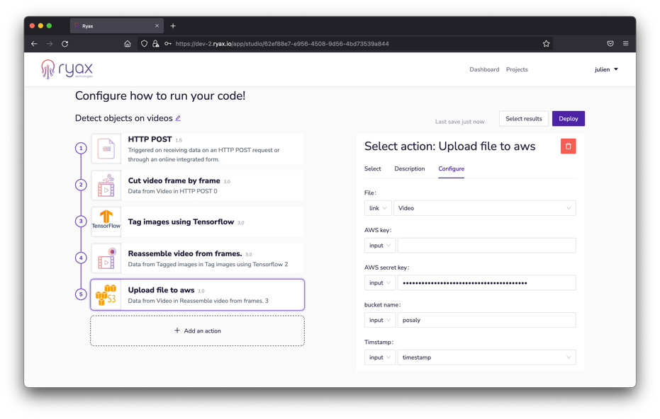

At this point we have a fully configured workflow ready to run!

## Deploying and running our AI-based workflow

The workflow is displaying no errors and shows a "deploy" button at the top right part of the panel: you can now click the "deploy" button!
It will lead you to the "run" management page:

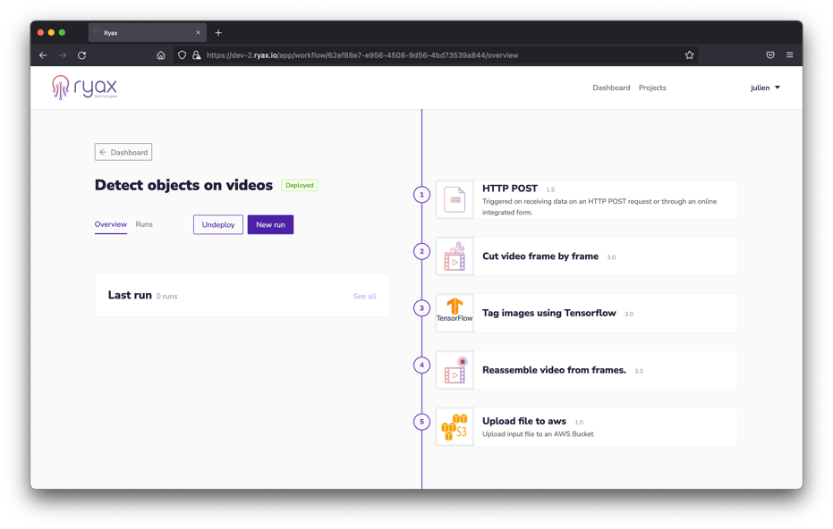

At this stage, our workflow is in a "deployed" state. Once deployed, your workflow enters a ready state where it can be triggered, receive inputs and propagate.
Workflow actuations are called "runs" in Ryax: everytime a workflow is triggered, it generates a run.

Click on "new run" to open the user form and generate our first workflow run. This is the page the user will see:

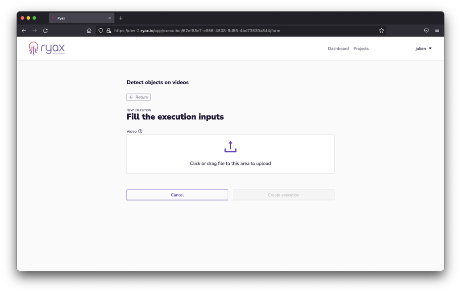

It is time to upload a video to trigger the execution of the AI-based application and test it. You can use the provided sample video below:

[Download sample input video](https://ryax.tech/wp-content/uploads/2022/09/dashcam720p.mov)

Once you added the video to the form, you can click on "Create execution" to run the object detection on that video.

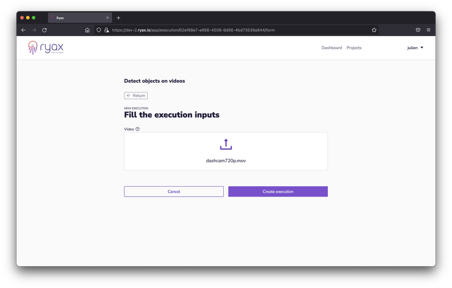

You'll then be taken back to the execution page, where you can observe the workflow running and propagating through all the steps we defined:

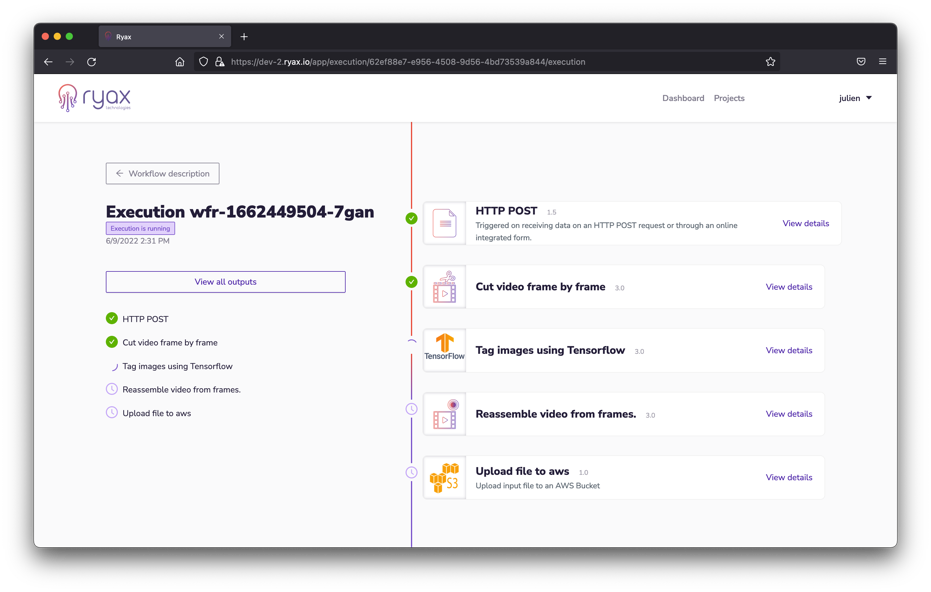

## Checking executions

In the execution pages, each workflow step can be expanded by clicking on "View details". Expanded views will show you runs timestamps, durations, input and outputs, as well as logs.

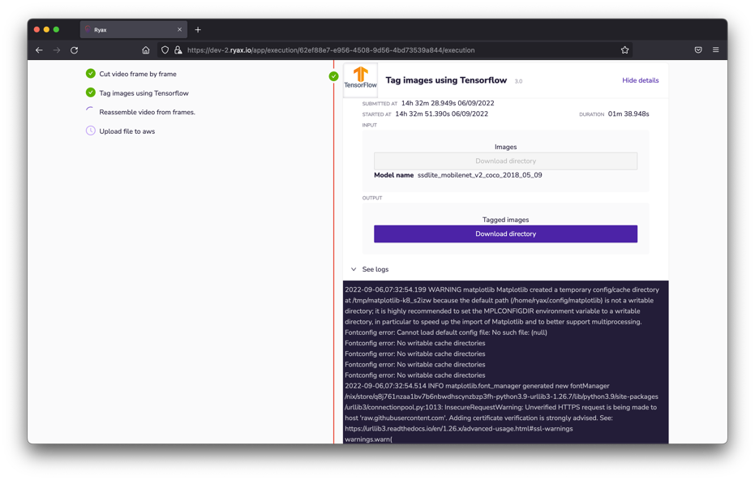

What's really handy with these views is you can download input and/or output data to check each and every step of your workflow. Being able to see step-by-step changes brought to inputs is very valuable in understanding/debugging/improving any backend workflow.
For example, you can download the entire tagged frame folder which is output of the object detection algorithm.

# Commit your own actions and use them in a workflow

Now that we've created a new workflow with existing actions, deployed and ran it, let's see how you can add your own code to a Ryax workflow.

Let's start by importing an action into Ryax. Clic on **Library** Menu.

## Add and Scan Git repositories

One of the most standard ways developers store, version, review and collaborate on their code is using Git repositories.
Leveraging this common practice, Ryax provides an interface able to pull code from any Git environment to create custom actions that can be used in Ryax
workflows.

The Library allows you to save and manage a list of repositories you wish to pull your code from.

To add a new repository, click the **Add** button at the top the repositories list. You'll be asked to enter a repo name and its URL:

For this guide, you can use the following public Gitlab directory we're providing: **[https://gitlab.com/ryax-tech/workflows/default-actions.git](https://gitlab.com/ryax-tech/workflows/default-actions.git)**

After entering you repo's name and URL, if your repository is private, you need to enter your credentials to allow access for Ryax to crawl your repo. For this example, we'll use the following login and password:

- Username: **anonymous**
- Password: **anonymous**

After filling in your repo's information, you can click the **New Scan** button to start searching for code to pull:

Ryax will crawl the Git URL you provided and list all recognizable actions in the "Scan results" panel.

!!! note
    For more information on how to build recognizable actions for Ryax, please refer to the "How-to" section of this documentation.

Reviewing the result list, we can for example see the "SQL Query" action.
Let's say this is the one we've just developed and wants to add to our workflow!

Now you may launch this specific action's build by clicking on the **Build** button to the top right.

The platform will automatically pull your action's code, package it in a productizable way and publish it in the Ryax store for future use in any workflow.

When successfully built, your action will appear in the selectable actions & triggers in the Library

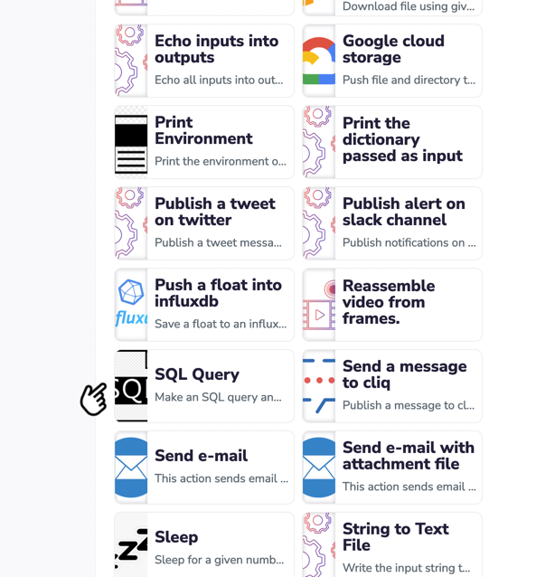

You'll then be able to use it into a workflow!
