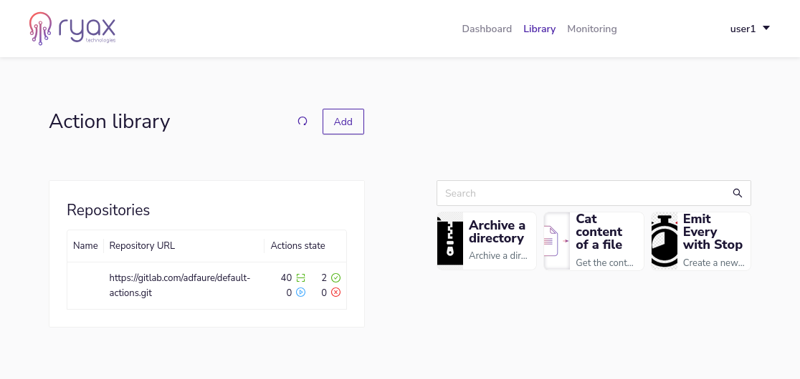
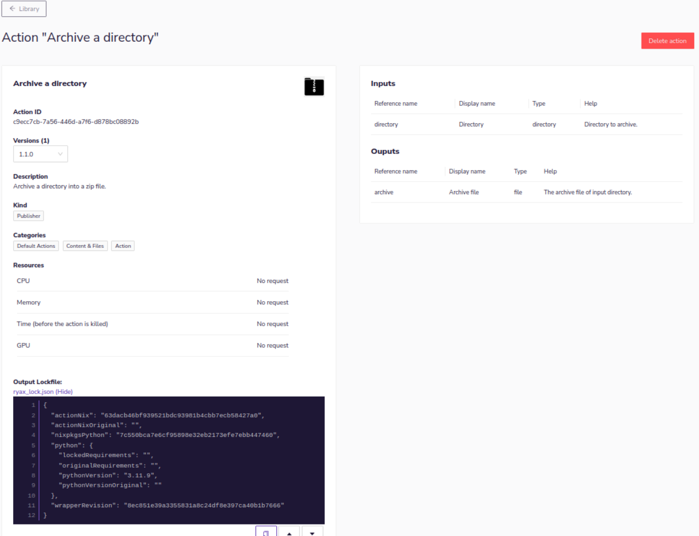
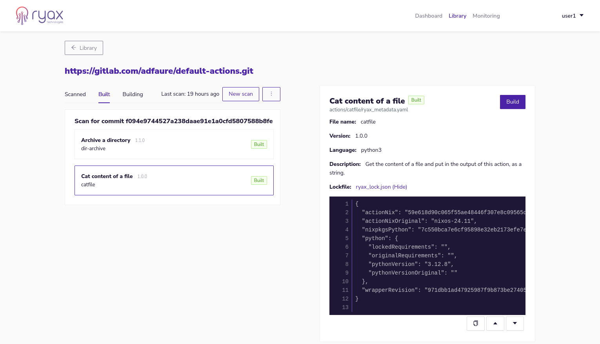

# Reproducible Build of Actions

## Building process -- What is a Lockfile

When building an action, the dependencies used are specific to the time of building. Without proper version tracking, rebuilding the same action later might use different dependency versions, which can lead to breaking changes and development issues.

To solve this, Ryax generates a `lockfile` during the build process that captures the complete build environment, including:
- Python version used
- Versions of all Python dependencies
- Nixpkgs version, and dependencies
- Action version

This lockfile can be committed with your action and will be used in future builds to ensure the exact same environment is reproduced.

## How to Get the Lockfile
The first time an action is built, it has no lockfile. To generate a lockfile, you need to build the action once (using the web application, in the library section). Once the action is built, you can display its information on the library page. The right part of the page in the image below, for instance click on the first action "Archive a directory".



At the bottom of the next page, on the left side, you can click on `ryax_lock.json (Show)` to display the lockfile content of your build.


The file lockfile should look like:
```json
{
  "actionNix": "63dacb46bf939521bdc93981b4cbb7ecb58427a0",
  "actionNixOriginal": "",
  "nixpkgsPython": "7c550bca7e6cf95898e32eb2173efe7ebb447460",
  "python": {
    "lockedRequirements": "",
    "originalRequirements": "",
    "pythonVersion": "3.11.9",
    "pythonVersionOriginal": ""
  },
  "wrapperRevision": "8ec851e39a3355831a8c24df8e397ca40b1b7666"
}
```
## Lock the Action Build Environment -- Commit Your Lockfile

The lockfile should be commited to the action folder of the action, under the name `ryax_lock.json`, whith the content obtained from the previous section. During the scan of your repository on the web interface, the lockfile will be detected as part of the action. To ensure that it was detected, the lockfile can be seen in the repository page of your action, such as depicted in the image below.



## Modifying a Locked Build Environment

While lockfiles ensure reproducible builds, they don't override the dependencies you specify in `ryax_metadata.yaml` (see [Python Action Reference](../reference/action_python3.md) for details). When you rebuild an action, Ryax:

Moreover, in case one or several fields are not specified, default values will be used and will show in the resulting lockfile.

1. Compares current dependencies with the lockfile
2. Identifies any changes
3. Updates the lockfile to reflect your new specifications

For example:
- If your lockfile specifies Python 3.9
- But your `ryax_metadata.yaml` specifies Python 3.12 (`spec.options.python.version`)
- The build will use Python 3.12
- A new lockfile will be generated reflecting this change


